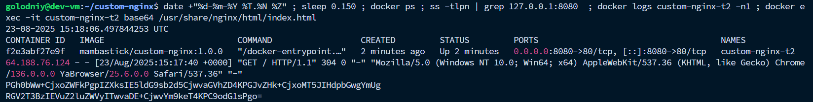

# Переименование контейнера
Если запускать с параметром -p 127.0.0.1:8080:80 , тогда index.html не отображается, проблема наблюдается именно в yandex cloud, не знаю почему так.
Убрав localhost (127.0.0.1) из параметров, все встает на свои места и контейнер успешно переименовывается, все отображается.

Вывод команды из VM:
```bash
date +"%d-%m-%Y %T.%N %Z" ; sleep 0.150 ; docker ps ; ss -tlpn | grep 127.0.0.1:8080  ; docker logs custom-nginx-t2 -n1 ; docker exec -it custom-nginx-t2 base64 /usr/share/nginx/html/index.html
```

```bash
23-08-2025 15:18:06.497844253 UTC
CONTAINER ID   IMAGE                           COMMAND                  CREATED         STATUS         PORTS                                     NAMES
f2e3abf27e9f   mambastick/custom-nginx:1.0.0   "/docker-entrypoint.…"   2 minutes ago   Up 2 minutes   0.0.0.0:8080->80/tcp, [::]:8080->80/tcp   custom-nginx-t2
64.188.76.124 - - [23/Aug/2025:15:17:40 +0000] "GET / HTTP/1.1" 304 0 "-" "Mozilla/5.0 (Windows NT 10.0; Win64; x64) AppleWebKit/537.36 (KHTML, like Gecko) Chrome/136.0.0.0 YaBrowser/25.6.0.0 Safari/537.36" "-"
PGh0bWw+CjxoZWFkPgpIZXksIE5ldG9sb2d5CjwvaGVhZD4KPGJvZHk+CjxoMT5JIHdpbGwgYmUg
RGV2T3BzIEVuZ2luZWVyITwvaDE+CjwvYm9keT4KPC9odG1sPgo=
```


