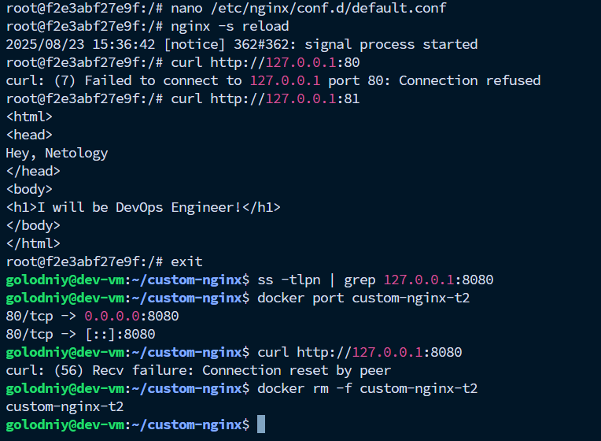

# Анализ контейнера и опыты над ним

**Вопрос**: Почему контейнер останавливается, когда жмем CTRL + C в терминале при `docker attach custom-nginx-t2` ?

**Ответ**: Потому что у контейнера только один основной процесс (PID 1). Когда он завершается — контейнер тоже завершается. При docker attach мы работали напрямую с этим процессом и прервали его Ctrl-C.

---

Про порты, я изменил порт с 80 на 81 в конфиге nginx и перезагрузил его.
После выполнил команды:

```bash
curl http://127.0.0.1:80
```
ее вывод:
```bash
curl: (7) Failed to connect to 127.0.0.1 port 80: Connection refused
```

и команда 
```bash
curl http://127.0.0.1:81
```

и ее вывод:
```bash
<html>
<head>
Hey, Netology
</head>
<body>
<h1>I will be DevOps Engineer!</h1>
</body>
</html>
```

почему так произошло ? мы поменяли в конфиге порт nginx и он слушает 81 порт, то есть наш index.html доступен по адресу 127.0.0.1:81, а не 127.0.0.1:80.

---

Я вышел из контейнера и запустил следующие команды:

```bash
ss -tlpn | grep 127.0.0.1:8080
```

она ничего не вывела, так как мы же поменяли порт внутри контейнера, соответственно проброшенный 8080 из ОС в контейнер тоже ничгео не даст

```bash
docker port custom-nginx-t2
```

просто вывел список проброшенных в контейнер портов:

```bash
80/tcp -> 0.0.0.0:8080
80/tcp -> [::]:8080
```

и еще одна команда, поведение которой описывается первой команды - изменили порты, ресурс недоступен, ловим ошибку:
```bash
curl http://127.0.0.1:8080
```
и вывод:
```bash
curl: (56) Recv failure: Connection reset by peer
```
---
Чтобы удалить контейнер, я воспользовался командой:

```bash
docker rm -f custom-nginx-t2
```

вывод:

```bash
custom-nginx-t2
```

---

