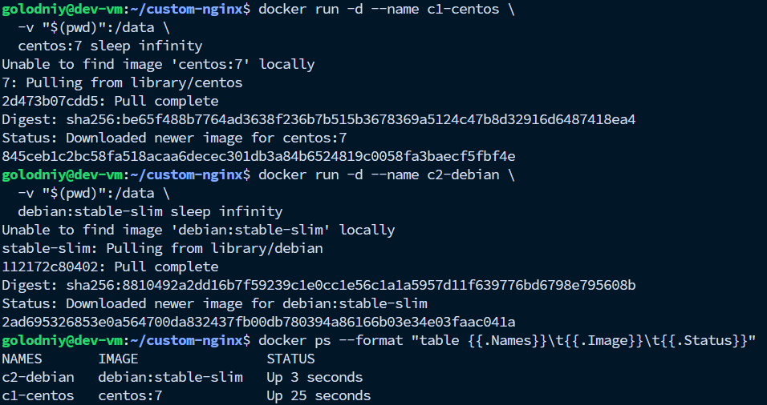
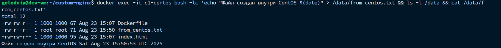
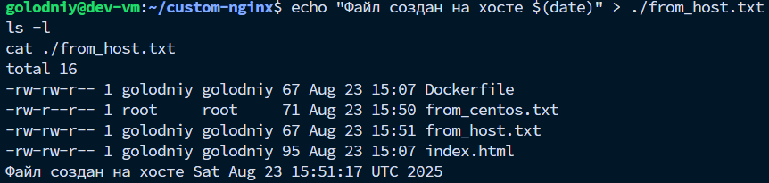
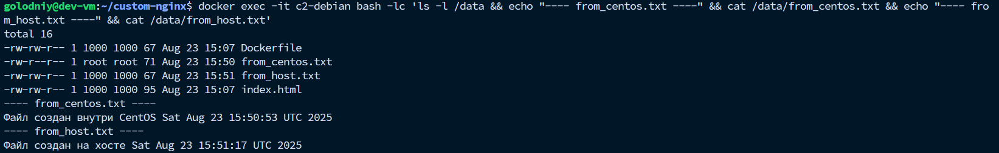

# Контейнеры и volume

### 1) Запустить контейнеры c общим volume = текущая папка

Запуск CentOS

```bash
docker run -d --name c1-centos \
  -v "$(pwd)":/data \
  centos:7 sleep infinity
```

```bash
Unable to find image 'centos:7' locally
7: Pulling from library/centos
2d473b07cdd5: Pull complete 
Digest: sha256:be65f488b7764ad3638f236b7b515b3678369a5124c47b8d32916d6487418ea4
Status: Downloaded newer image for centos:7
845ceb1c2bc58fa518acaa6decec301db3a84b6524819c0058fa3baecf5fbf4e
```

Запуск Debian

```bash
docker run -d --name c2-debian \
  -v "$(pwd)":/data \
  debian:stable-slim sleep infinity
```

```bash
Unable to find image 'debian:stable-slim' locally
stable-slim: Pulling from library/debian
112172c80402: Pull complete 
Digest: sha256:8810492a2dd16b7f59239c1e0cc1e56c1a1a5957d11f639776bd6798e795608b
Status: Downloaded newer image for debian:stable-slim
2ad695326853e0a564700da832437fb00db780394a86166b03e34e03faac041a
```

Проверка, что контейнеры взлетели
```bash
docker ps --format "table {{.Names}}\t{{.Image}}\t{{.Status}}"
```

```bash
NAMES       IMAGE                STATUS
c2-debian   debian:stable-slim   Up 4 minutes
c1-centos   centos:7             Up 5 minutes
```



### 2) Создать файл внутри первого контейнера (CentOS)

```bash
docker exec -it c1-centos bash -lc 'echo "Файл создан внутри CentOS $(date)" > /data/from_centos.txt && ls -l /data && cat /data/from_centos.txt'
```

```bash
total 12
-rw-rw-r-- 1 1000 1000 67 Aug 23 15:07 Dockerfile
-rw-r--r-- 1 root root 71 Aug 23 15:50 from_centos.txt
-rw-rw-r-- 1 1000 1000 95 Aug 23 15:07 index.html
Файл создан внутри CentOS Sat Aug 23 15:50:53 UTC 2025
```



### 3) Создать ещё один файл на хосте (в текущей папке)

```bash
echo "Файл создан на хосте $(date)" > ./from_host.txt
ls -l
cat ./from_host.txt
```

```bash
total 16
-rw-rw-r-- 1 golodniy golodniy 67 Aug 23 15:07 Dockerfile
-rw-r--r-- 1 root     root     71 Aug 23 15:50 from_centos.txt
-rw-rw-r-- 1 golodniy golodniy 67 Aug 23 15:51 from_host.txt
-rw-rw-r-- 1 golodniy golodniy 95 Aug 23 15:07 index.html
Файл создан на хосте Sat Aug 23 15:51:17 UTC 2025
```



### 4) Проверить во втором контейнере (Debian), что оба файла видны

```bash
docker exec -it c2-debian bash -lc 'ls -l /data && echo "---- from_centos.txt ----" && cat /data/from_centos.txt && echo "---- from_host.txt ----" && cat /data/from_host.txt'
```

```bash
total 16
-rw-rw-r-- 1 1000 1000 67 Aug 23 15:07 Dockerfile
-rw-r--r-- 1 root root 71 Aug 23 15:50 from_centos.txt
-rw-rw-r-- 1 1000 1000 67 Aug 23 15:51 from_host.txt
-rw-rw-r-- 1 1000 1000 95 Aug 23 15:07 index.html
---- from_centos.txt ----
Файл создан внутри CentOS Sat Aug 23 15:50:53 UTC 2025
---- from_host.txt ----
Файл создан на хосте Sat Aug 23 15:51:17 UTC 2025
```

