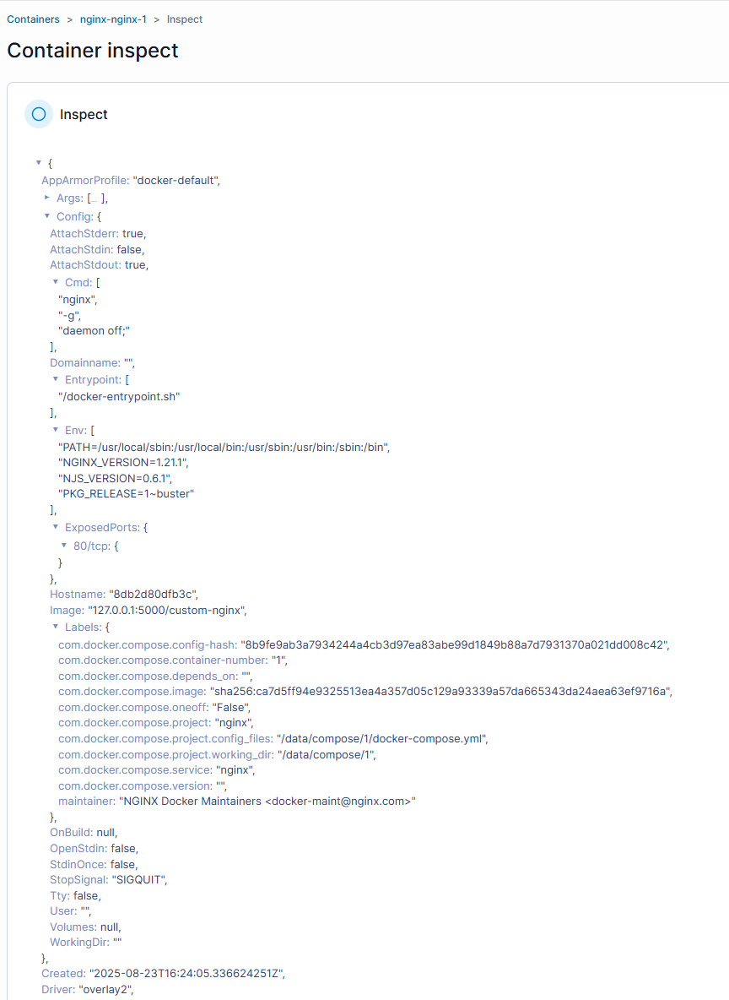

# Docker Compose, Portainer, Registry

## 1. Подготовка файлов

Создали директорию и два файла:

```bash
mkdir -p /tmp/netology/docker/task5 && cd /tmp/netology/docker/task5
````

**compose.yaml** (Portainer):

```yaml
version: "3"
services:
  portainer:
    network_mode: host
    image: portainer/portainer-ce:latest
    volumes:
      - /var/run/docker.sock:/var/run/docker.sock
```

**docker-compose.yaml** (Registry):

```yaml
version: "3"
services:
  registry:
    image: registry:2
    ports:
      - "5000:5000"
```

---

## 2. Первый запуск

```bash
docker compose up -d
```

Вывод:

```
WARN[0000] Found multiple config files ...
WARN[0000] Using /tmp/netology/docker/task5/compose.yaml 
...
✔ Container task5-portainer-1  Started
```

**Ответ:** запустился именно **compose.yaml** (Portainer), потому что Compose ищет файлы в порядке приоритета:
`compose.yaml` → `compose.yml` → `docker-compose.yaml` → `docker-compose.yml`.

---

## 3. Совместный запуск обоих файлов

Отредактировали `compose.yaml` (добавили `include` на `docker-compose.yaml`).

Запуск:

```bash
docker compose up -d
```

Вывод:

```
✔ Container task5-registry-1   Started
✔ Container task5-portainer-1  Started
```

Оба контейнера успешно работают.

---

## 4. Перезапуск сервисов

```bash
docker compose restart
```

Вывод:

```
✔ Container task5-registry-1   Started
✔ Container task5-portainer-1  Started
```

---

## 5. Подготовка и пуш образа в локальный Registry

Тегировали и пушили:

```bash
docker tag mambastick/custom-nginx:1.0.0 custom-nginx:latest
sudo tee /etc/docker/daemon.json <<'EOF'
{
  "insecure-registries": ["127.0.0.1:5000"]
}
EOF
sudo systemctl restart docker
docker tag custom-nginx:latest 127.0.0.1:5000/custom-nginx:latest
docker push 127.0.0.1:5000/custom-nginx:latest
```

Вывод:

```
latest: digest: sha256:38db2d37e466639e... size: 1777
```

Проверка:

```bash
curl -s http://127.0.0.1:5000/v2/_catalog | jq .
```

Результат:

```json
{
  "repositories": [
    "custom-nginx"
  ]
}
```

---
## 6. Запуск nginx из portainer:




## 6. Удаление compose.yaml и повторный запуск

```bash
rm -rf compose.yaml 
docker compose up -d
```

Вывод:

```
WARN[0000] Found orphan containers ([task5-portainer-1]) for this project.
If you removed or renamed this service in your compose file, you can run this command with the --remove-orphans flag to clean it up.
✔ Container task5-registry-1  Running
```

**Ответ:** Появилось предупреждение об **orphan containers** (осиротевшие контейнеры) — это сервисы, запущенные ранее (Portainer), но отсутствующие в текущем compose-файле.
Решение — запустить с `--remove-orphans`, чтобы удалить лишние контейнеры.

---

## 7. Остановка проекта одной командой

```bash
docker compose down
```

Вывод:

```
✔ Container task5-registry-1  Removed
✔ Network task5_default       Removed
```

---

Скрины с вводимыми команадми:


