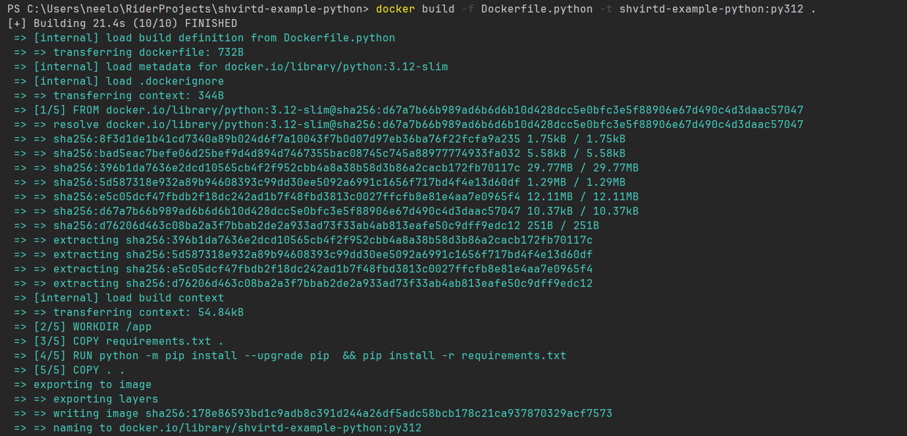
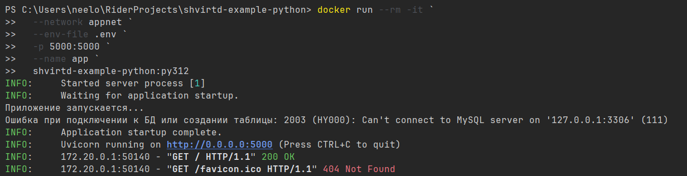

# Задача 1

Fork репозитория находится тут: https://github.com/mambastick/shvirtd-example-python
Также репозиторий добавлен как подмодуль в директорию `04-docker-in-practice` и назван `shvirtd-example-python`.

Сборка контейнера выполняется, все ок:

А также его запуск:

но так как базу данных мы не запускали, то естественно приложение к нему не может подключиться.
я проанализировал код main.py и увидел, что там захардкоден хост до БД - 127.0.0.1, я бы мог его сменить, но это "запрещено" заданием.
конечно же такие переменные должны быть вынесеными в .env или другую систему хранения секретов.