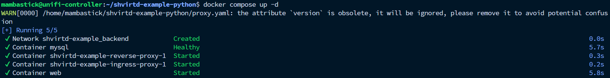

# Задача 3

Приложения запущены:


лог из mysql:
```bash
mysql> SELECT * FROM requests LIMIT 10;
+----+---------------------+-------------+
| id | request_date        | request_ip  |
+----+---------------------+-------------+
|  1 | 2025-08-24 18:55:28 | 192.168.3.1 |
|  2 | 2025-08-24 18:55:32 | 192.168.3.1 |
|  3 | 2025-08-24 18:55:33 | 192.168.3.1 |
|  4 | 2025-08-24 18:55:34 | 192.168.3.1 |
|  5 | 2025-08-24 18:55:38 | 192.168.3.1 |
|  6 | 2025-08-24 18:55:39 | 192.168.3.1 |
|  7 | 2025-08-24 18:55:39 | 192.168.3.1 |
|  8 | 2025-08-24 18:55:39 | 192.168.3.1 |
|  9 | 2025-08-24 18:55:39 | 192.168.3.1 |
| 10 | 2025-08-24 18:55:39 | 192.168.3.1 |
+----+---------------------+-------------+
10 rows in set (0.00 sec)
```
192.168.3.1, так как я запустил на своей домашней ВМ, которая стоит в другой подсети и приложение почему-то берет адрес шлюза.
