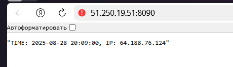
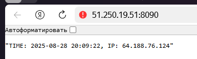
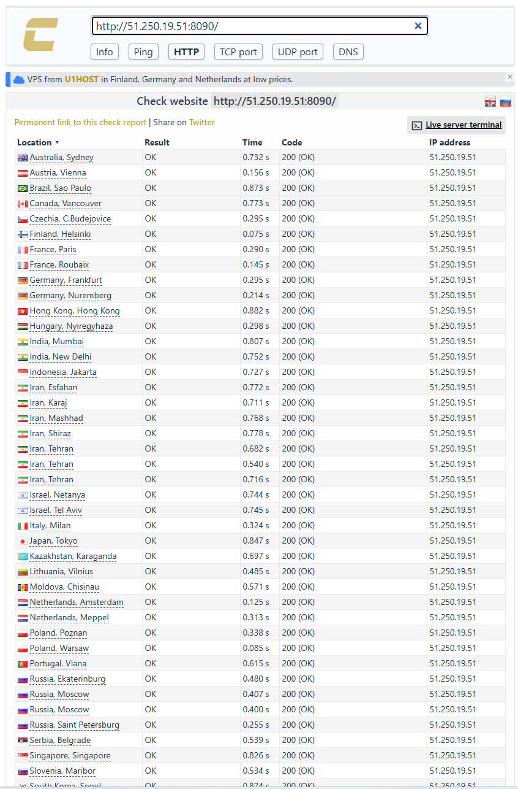

# Задание 4

## Ссылка на форк:
https://github.com/mambastick/shvirtd-example-python

## Скриншоты выполнения:




## Результат SQL запроса
```bash
mysql> select * from requests;
+----+---------------------+-----------------+
| id | request_date        | request_ip      |
+----+---------------------+-----------------+
|  1 | 2025-08-28 20:08:57 | 64.188.76.124   |
|  2 | 2025-08-28 20:08:59 | 64.188.76.124   |
|  3 | 2025-08-28 20:09:00 | 64.188.76.124   |
|  4 | 2025-08-28 20:09:22 | 64.188.76.124   |
|  5 | 2025-08-28 20:09:22 | 64.188.76.124   |
|  6 | 2025-08-28 20:09:43 | 185.19.33.131   |
|  7 | 2025-08-28 20:09:44 | 185.209.161.145 |
|  8 | 2025-08-28 20:09:44 | 195.137.244.1   |
|  9 | 2025-08-28 20:09:44 | 65.109.182.130  |
| 10 | 2025-08-28 20:09:44 | 185.224.3.111   |
| 11 | 2025-08-28 20:09:44 | 167.235.135.184 |
| 12 | 2025-08-28 20:09:44 | 195.211.27.85   |
| 13 | 2025-08-28 20:09:44 | 185.37.147.117  |
| 14 | 2025-08-28 20:09:44 | 195.154.114.92  |
| 15 | 2025-08-28 20:09:44 | 178.216.200.169 |
| 16 | 2025-08-28 20:09:44 | 45.159.248.77   |
| 17 | 2025-08-28 20:09:44 | 179.43.148.195  |
| 18 | 2025-08-28 20:09:44 | 91.231.182.39   |
| 19 | 2025-08-28 20:09:44 | 45.9.168.235    |
| 20 | 2025-08-28 20:09:44 | 77.75.230.51    |
| 21 | 2025-08-28 20:09:44 | 185.25.204.60   |
| 22 | 2025-08-28 20:09:44 | 185.221.199.82  |
| 23 | 2025-08-28 20:09:44 | 194.26.100.165  |
| 24 | 2025-08-28 20:09:44 | 78.40.111.151   |
| 25 | 2025-08-28 20:09:44 | 194.26.229.20   |
| 26 | 2025-08-28 20:09:44 | 185.130.104.238 |
| 27 | 2025-08-28 20:09:44 | 185.83.213.25   |
| 28 | 2025-08-28 20:09:44 | 83.143.119.103  |
| 29 | 2025-08-28 20:09:44 | 88.119.179.10   |
| 30 | 2025-08-28 20:09:44 | 78.40.116.61    |
| 31 | 2025-08-28 20:09:44 | 194.146.57.64   |
| 32 | 2025-08-28 20:09:44 | 77.92.151.181   |
| 33 | 2025-08-28 20:09:44 | 147.45.113.30   |
| 34 | 2025-08-28 20:09:44 | 178.17.171.235  |
| 35 | 2025-08-28 20:09:44 | 145.224.123.194 |
| 36 | 2025-08-28 20:09:44 | 185.23.17.21    |
| 37 | 2025-08-28 20:09:44 | 185.86.77.126   |
| 38 | 2025-08-28 20:09:44 | 94.183.156.152  |
| 39 | 2025-08-28 20:09:44 | 185.185.132.179 |
| 40 | 2025-08-28 20:09:44 | 109.122.245.39  |
| 41 | 2025-08-28 20:09:44 | 195.211.24.48   |
| 42 | 2025-08-28 20:09:44 | 178.239.146.199 |
| 43 | 2025-08-28 20:09:44 | 185.105.238.209 |
| 44 | 2025-08-28 20:09:44 | 103.42.116.205  |
| 45 | 2025-08-28 20:09:44 | 194.5.50.94     |
| 46 | 2025-08-28 20:09:44 | 185.143.223.66  |
| 47 | 2025-08-28 20:09:44 | 185.120.77.165  |
| 48 | 2025-08-28 20:09:44 | 157.254.174.204 |
| 49 | 2025-08-28 20:09:44 | 88.135.72.11    |
| 50 | 2025-08-28 20:09:44 | 185.24.253.139  |
| 51 | 2025-08-28 20:09:44 | 103.99.52.202   |
| 52 | 2025-08-28 20:09:44 | 198.135.169.20  |
| 53 | 2025-08-28 20:09:44 | 64.72.205.76    |
| 54 | 2025-08-28 20:09:44 | 45.162.230.209  |
| 55 | 2025-08-28 20:09:44 | 217.15.166.168  |
| 56 | 2025-08-28 20:09:44 | 31.57.50.241    |
| 57 | 2025-08-28 20:09:44 | 141.98.234.68   |
| 58 | 2025-08-28 20:09:44 | 45.252.248.142  |
| 59 | 2025-08-28 20:09:44 | 103.214.169.52  |
| 60 | 2025-08-28 20:09:45 | 46.250.241.154  |
| 61 | 2025-08-28 20:09:45 | 38.145.202.12   |
| 62 | 2025-08-28 20:09:45 | 109.248.161.218 |
| 63 | 2025-08-28 20:10:03 | 87.250.224.232  |
+----+---------------------+-----------------+
63 rows in set (0.00 sec)

mysql>
```