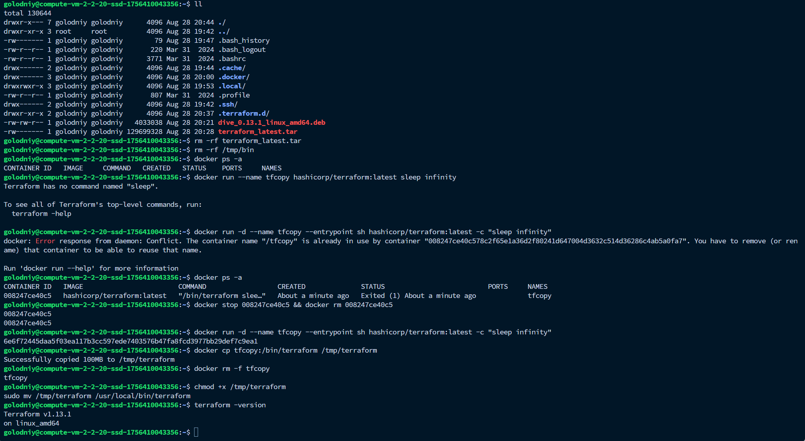

# Задача 6.1

Выполняется практически аналогично задаче 6, но используя docker cp.
---

### Очистка

```bash
# Удаляем каталог с распакованным образом
rm -rf ~/terraform_image
rm -f /tmp/terraform_image.tar
rm -rf ~/terraform_latest.tar

# Удаляем временные бинарники
rm -rf /tmp/bin

# Контейнеры от этого задания 6  удалить:
docker ps -a 
docker rm -f <container_id> # если есть, что удалять
```
---

### Выполнение задания через `docker cp`

1. Запускаем временный контейнер:

```bash
docker run -d --name tfcopy --entrypoint sh hashicorp/terraform:latest -c "sleep infinity"
```

2. Копируем бинарь из контейнера на хост:

```bash
docker cp tfcopy:/bin/terraform /tmp/terraform
```

3. Останавливаем и удаляем контейнер:

```bash
docker rm -f tfcopy
```

4. Переносим бинарь в PATH:

```bash
chmod +x /tmp/terraform
sudo mv /tmp/terraform /usr/local/bin/terraform
```

5. Проверяем:

```bash
terraform -version
```

---

# Скрин:
