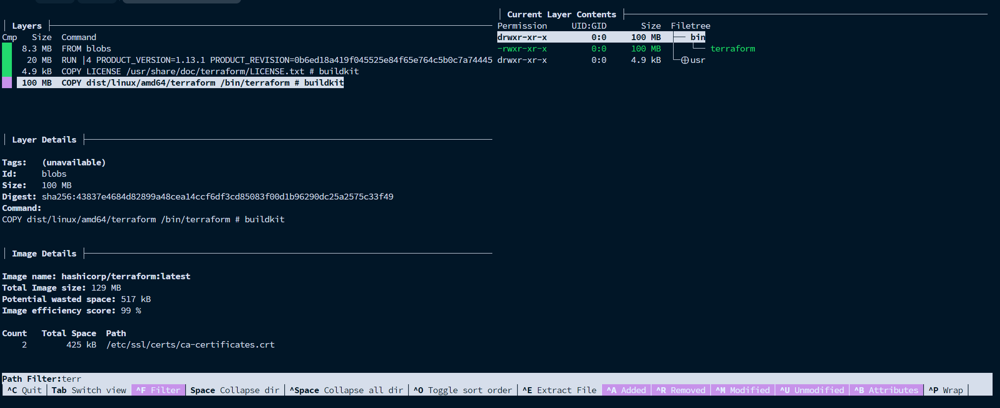
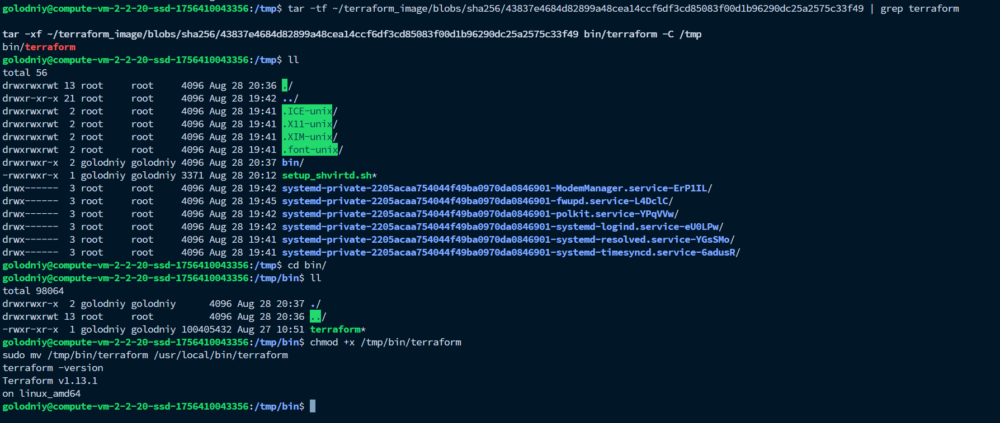
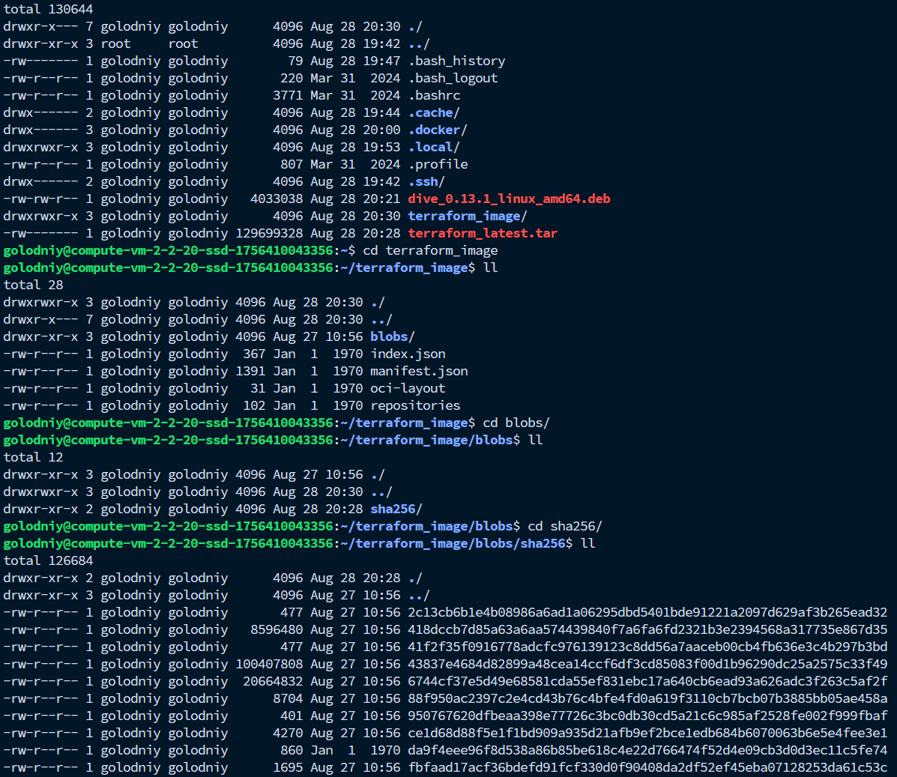

# Задача 6

1. Скачивание image terraform:
```bash
docker pull hashicorp/terraform:latest
```
 ```bash
 golodniy@compute-vm-2-2-20-ssd-1756410043356:~$ docker pull hashicorp/terraform:latest
latest: Pulling from hashicorp/terraform
df603300ccbc: Pull complete 
61efee67924a: Pull complete 
7915457192ae: Pull complete 
56e3ce7cfd79: Pull complete 
Digest: sha256:e1f495e626fdbd6ca9e451a474ad7a4ed6b446e383c17fadc6a7dd3e922178f5
Status: Downloaded newer image for hashicorp/terraform:latest
docker.io/hashicorp/terraform:latest
 ```

2. Установка dive из репозитория https://github.com/wagoodman/dive
```bash
DIVE_VERSION=$(curl -sL "https://api.github.com/repos/wagoodman/dive/releases/latest" | grep '"tag_name":' | sed -E 's/.*"v([^"]+)".*/\1/')
curl -fOL "https://github.com/wagoodman/dive/releases/download/v${DIVE_VERSION}/dive_${DIVE_VERSION}_linux_amd64.deb"
sudo apt install ./dive_${DIVE_VERSION}_linux_amd64.deb
```

```bash
golodniy@compute-vm-2-2-20-ssd-1756410043356:~$ DIVE_VERSION=$(curl -sL "https://api.github.com/repos/wagoodman/dive/releases/latest" | grep '"tag_name":' | sed -E 's/.*"v([^"]+)".*/\1/')
curl -fOL "https://github.com/wagoodman/dive/releases/download/v${DIVE_VERSION}/dive_${DIVE_VERSION}_linux_amd64.deb"
sudo apt install ./dive_${DIVE_VERSION}_linux_amd64.deb
  % Total    % Received % Xferd  Average Speed   Time    Time     Time  Current
                                 Dload  Upload   Total   Spent    Left  Speed
  0     0    0     0    0     0      0      0 --:--:-- --:--:-- --:--:--     0
100 3938k  100 3938k    0     0  5972k      0 --:--:-- --:--:-- --:--:-- 5972k
Reading package lists... Done
Building dependency tree... Done
Reading state information... Done
Note, selecting 'dive' instead of './dive_0.13.1_linux_amd64.deb'
The following NEW packages will be installed:
  dive
0 upgraded, 1 newly installed, 0 to remove and 1 not upgraded.
Need to get 0 B/4033 kB of archives.
After this operation, 9863 kB of additional disk space will be used.
Get:1 /home/golodniy/dive_0.13.1_linux_amd64.deb dive amd64 0.13.1 [4033 kB]
Selecting previously unselected package dive.
(Reading database ... 106576 files and directories currently installed.)
Preparing to unpack .../dive_0.13.1_linux_amd64.deb ...
Unpacking dive (0.13.1) ...
Setting up dive (0.13.1) ...
Scanning processes...                                                                                                                                                                                   
Scanning linux images...                                                                                                                                                                                

Pending kernel upgrade!
Running kernel version:
  6.8.0-78-generic
Diagnostics:
  The currently running kernel version is not the expected kernel version 6.8.0-79-generic.

Restarting the system to load the new kernel will not be handled automatically, so you should consider rebooting.

No services need to be restarted.

No containers need to be restarted.

No user sessions are running outdated binaries.

No VM guests are running outdated hypervisor (qemu) binaries on this host.
N: Download is performed unsandboxed as root as file '/home/golodniy/dive_0.13.1_linux_amd64.deb' couldn't be accessed by user '_apt'. - pkgAcquire::Run (13: Permission denied)
golodniy@compute-vm-2-2-20-ssd-1756410043356:~$ sudo !!
sudo sudo apt install ./dive_${DIVE_VERSION}_linux_amd64.deb
Reading package lists... Done
Building dependency tree... Done
Reading state information... Done
Note, selecting 'dive' instead of './dive_0.13.1_linux_amd64.deb'
dive is already the newest version (0.13.1).
0 upgraded, 0 newly installed, 0 to remove and 1 not upgraded.
```

3. Работа с dive
```bash
dive hashicorp/terraform:latest
```
Слевы выбран слой image, а справа с помощью фильтрации найден бинарник terraform.


4. Извлечение /bin/terraform на хост

Пакуем image:
```bash
docker save -o terraform_latest.tar hashicorp/terraform:latest
```

Создаем директорию под image и распаковываем его туда:
```bash
mkdir terraform_image
tar -xf terraform_latest.tar -C terraform_image
```

5. Извлекаем бинарь на хост

Создаем директорию для terraform:
```bash
mkdir -p /tmp/bin
```

Берем нужный layer из dive, в котором находится terraform (Layer Details, строчка Digest после sha256:<нужный код>) и распаковываем terraform в /tmp/bin/terraform:
```bash
tar -xf ~/terraform_image/blobs/sha256/43837e4684d82899a48cea14ccf6df3cd85083f00d1b96290dc25a2575c33f49 bin/terraform -C /tmp
```

Даем права на исполнение:
```bash
chmod +x /tmp/bin/terraform
```

Перемещаем terraform в директорию /usr/local/bin/
```bash
sudo mv /tmp/bin/terraform /usr/local/bin/terraform
```

и наконец проверяем работу terraform:
```bash
terraform -version
```

получаем вывод:
```bash
Terraform v1.13.1
on linux_amd64
```

---

Скрины:


