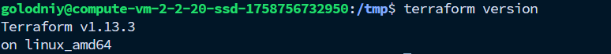
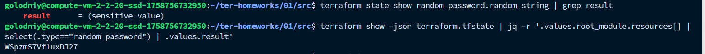
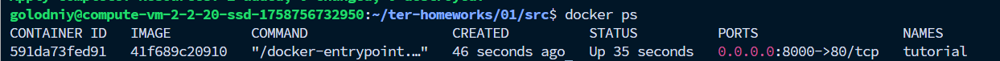
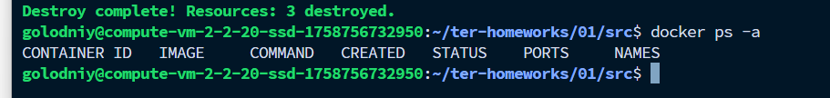

# Задане 1. Terraform.

1. Установлен Terraform:

2. Установлен Docker:

3. .gitignore - *personal.auto.tfvars*, а вообще желательно все хранить в внешних хранилищах: Hashicorp Vault, Jenkins Credentials, GitHub Secrets и т.д.

4. Вывод пароля:

я сделал через json, но можно было поставить `sensitive = false` в `main.tf` у блока с паролем

5. Поправили и расскоментировали блок с докером:

6. Подняли nginx с помощью `terraform apply`:

7. Сделали `terraform destroy`:

8. Из-за `keep_locally = true` образ не удаляется при `destroy`.