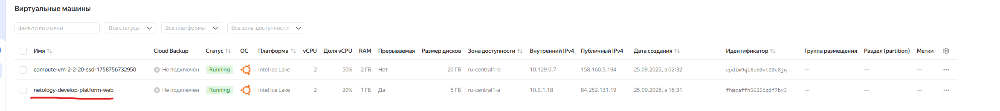

# Задание 1

1. Успешно выполнен terraform init:

2. Настройка (поменял там переменные в main.tf, providers.tf и создал свой файл с переменными) и валидация конфига выполнена:

3. `terraform apply` выполнен успешно, ВМ создалась:

4. На ВМ удалось зайти и выполнить команду `curl ifconfig.me`

5. Теперь о `preemptible = true` и `core_fraction=5` в параметрах ВМ:\

Что такое `preemptible = true`:\
Это прерываемая ВМ со скидкой. Яндекс может остановить её в любой момент (максимум через 24 часа). Идеальна для обучения, тестов, временных стендов.

Что такое `core_fraction = 5`:\
Это «доля CPU» у burstable-процессоров. При 5% ВМ сильно дешевле, но гарантированно получает только 5% CPU. Хорошо для учебных окружений, CI, тестов, лёгких сервисов.