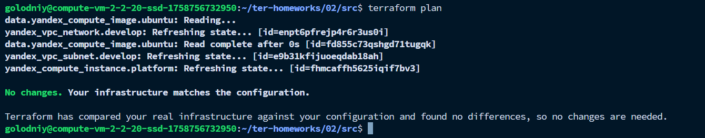

# Задание 2

1. В `variables.tf` я добавил:

```terraform
### Task 2

# -------- VM (web) image --------
variable "vm_web_image_family" {
  type        = string
  default     = "ubuntu-2004-lts"   # если у тебя в data источник другой family — поставь его
  description = "Image family for web VM"
}

variable "vm_web_image_folder_id" {
  type        = string
  default     = "standard-images"
  description = "Folder ID where public images live"
}

# -------- VM (web) instance props --------
variable "vm_web_name" {
  type        = string
  default     = "netology-develop-platform-web"
  description = "Instance name"
}

variable "vm_web_platform_id" {
  type        = string
  default     = "standard-v3" 
  description = "Platform ID (e.g. standard-v1|v2|v3). null to omit"
}

variable "vm_web_cores" {
  type        = number
  default     = 2
  description = "vCPU count"
}

variable "vm_web_memory" {
  type        = number
  default     = 1
  description = "RAM in GB"
}

variable "vm_web_core_fraction" {
  type        = number
  default     = 20
  description = "Burstable CPU share: 5|20|50|100"
}

variable "vm_web_preemptible" {
  type        = bool
  default     = true
  description = "Use preemptible VM"
}

variable "vm_web_disk_type" {
  type        = string
  default     = "network-hdd"
  description = "Boot disk type"
}

variable "vm_web_nat" {
  type        = bool
  default     = true
  description = "Attach external IP (NAT)"
}

variable "vm_web_network_acceleration_type" {
  type        = string
  default     = "standard"
  description = "Network acceleration type"
}
```

2. Поправил `main.tf` на использование этих переменных:
```terraform
resource "yandex_vpc_network" "develop" {
  name = var.vpc_name
}
resource "yandex_vpc_subnet" "develop" {
  name           = var.vpc_name
  zone           = var.zone
  network_id     = yandex_vpc_network.develop.id
  v4_cidr_blocks = var.default_cidr
}

data "yandex_compute_image" "ubuntu" {
  family    = var.vm_web_image_family
  folder_id = var.vm_web_image_folder_id
}

resource "yandex_compute_instance" "platform" {
  name                      = var.vm_web_name
  platform_id               = var.vm_web_platform_id
  network_acceleration_type = var.vm_web_network_acceleration_type

  resources {
    cores         = var.vm_web_cores
    memory        = var.vm_web_memory
    core_fraction = var.vm_web_core_fraction
  }

  scheduling_policy {
    preemptible = var.vm_web_preemptible
  }

  boot_disk {
    initialize_params {
      image_id = data.yandex_compute_image.ubuntu.id
      type     = var.vm_web_disk_type
    }
  }

  network_interface {
    subnet_id = yandex_vpc_subnet.develop.id
    nat       = var.vm_web_nat
    ipv4      = true
  }

  metadata = {
    serial-port-enable = "1"
    ssh-keys = var.vms_ssh_public_root_key
  }
}
```

3. `terraform validate`:


4. `terraform plan`:
