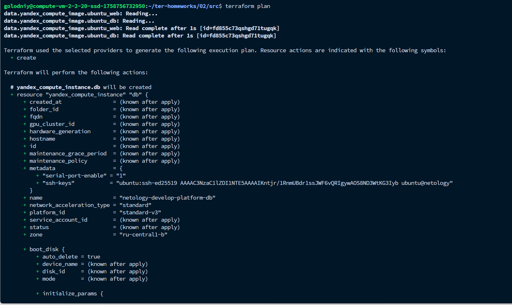
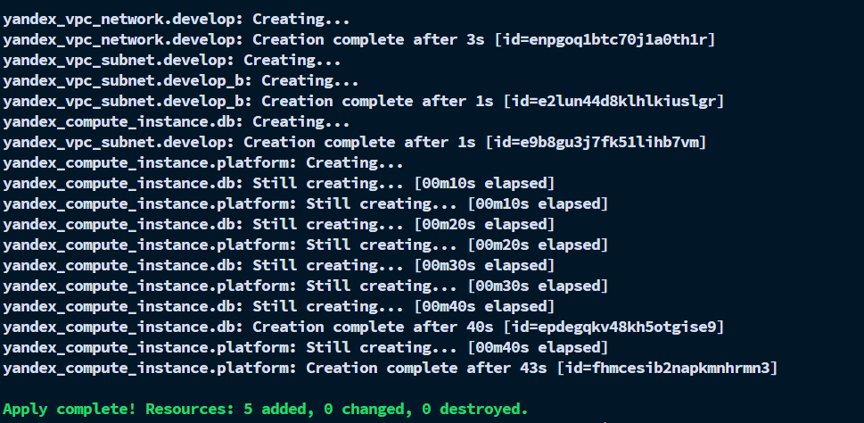
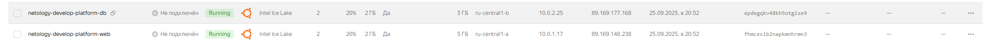

# Задание 3

1. Был исправлен `variables.tf`, закоментирован блок из предыдущего задания.
2. Был создан файл `vms_platform.tf`, в который была занесена основная конфигурация:
```terraform
########################
# VM (web)
########################
variable "vm_web_image_family" {
  type        = string
  default     = "ubuntu-2004-lts"
  description = "Image family for web VM"
}

variable "vm_web_image_folder_id" {
  type        = string
  default     = "standard-images"
  description = "Images folder"
}

variable "vm_web_name" {
  type        = string
  default     = "netology-develop-platform-web"
  description = "Web instance name"
}

variable "vm_web_platform_id" {
  type        = string
  default     = "standard-v3"
  description = "Platform ID"
}

variable "vm_web_cores" {
  type        = number
  default     = 2
}
variable "vm_web_memory" {
  type        = number
  default     = 2
}
variable "vm_web_core_fraction" {
  type        = number
  default     = 20
}
variable "vm_web_preemptible" {
  type        = bool
  default     = true
}
variable "vm_web_disk_type" {
  type        = string
  default     = "network-hdd"
}
variable "vm_web_nat" {
  type        = bool
  default     = true
}
variable "vm_web_network_acceleration_type" {
  type        = string
  default     = "standard"
}

########################
# VM (db) — новая
########################
variable "vm_db_image_family" {
  type        = string
  default     = "ubuntu-2004-lts"
}
variable "vm_db_image_folder_id" {
  type        = string
  default     = "standard-images"
}
variable "vm_db_name" {
  type        = string
  default     = "netology-develop-platform-db"
}
variable "vm_db_platform_id" {
  type        = string
  default     = "standard-v3"
}
variable "vm_db_cores" {
  type        = number
  default     = 2
}
variable "vm_db_memory" {
  type        = number
  default     = 2
}
variable "vm_db_core_fraction" {
  type        = number
  default     = 20
}
variable "vm_db_preemptible" {
  type        = bool
  default     = true
}
variable "vm_db_disk_type" {
  type        = string
  default     = "network-hdd"
}
variable "vm_db_nat" {
  type        = bool
  default     = true
}
variable "vm_db_network_acceleration_type" {
  type        = string
  default     = "standard"
}
# Зона для DB — по заданию ru-central1-b
variable "vm_db_zone" {
  type        = string
  default     = "ru-central1-b"
  description = "Zone for DB VM"
}
```

3. Выполнил `terraform validate`


4. Выполнил `terraform plan`


5. Выполнил `terraform apply`

