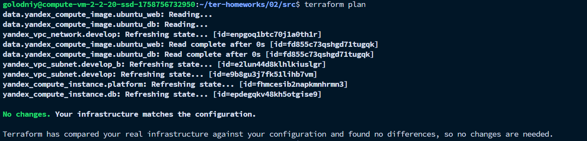

# Задание 5

Создан файл `locals.tf`, в который загружена следующая конфигурация:
```terraform
locals {
  vm_names = {
    web = "netology-${var.vpc_name}-platform-web"
    db  = "netology-${var.vpc_name}-platform-db"
  }
}
```

В файле `main.tf` заменил использование переменных `vm_web_name` и `vm_db_name` на локальные переменные.\

В файле `vms_platform.tf` закомментированы переменные `vm_web_name` и `vm_db_name`.\

Проверил конфигурацию и план
