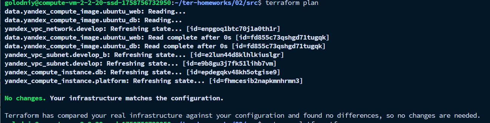

# Задание 6

* Объединил переменные `cores`, `memory`, `core_fraction` в одну карту `vms_resources`.

* Добавил отдельную переменную `metadata` для общей конфигурации метаданных.

* В `main.tf` ресурсы для ВМ читают значения из `var.vms_resources["web"]` и `var.vms_resources["db"]`.

* Для `metadata` применён merge:

  ```hcl
  metadata = merge(var.metadata, { ssh-keys = var.vms_ssh_public_root_key })
  ```

* В `terraform.tfvars` заданы значения:

  ```hcl
  vms_resources = {
    web = {
      cores         = 2
      memory        = 2
      core_fraction = 20
    }
    db = {
      cores         = 2
      memory        = 2
       core_fraction = 20
    }
  }

  metadata = {
    serial-port-enable = "1"
  }
  ```

* Закомментированы старые переменные: `*_cores`, `*_memory`, `*_core_fraction`, `*_name`.

* После изменений `terraform plan` показал `No changes. Your infrastructure matches the configuration.`

