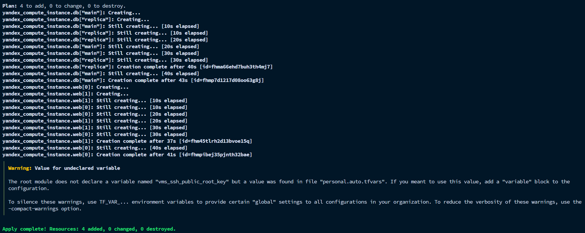
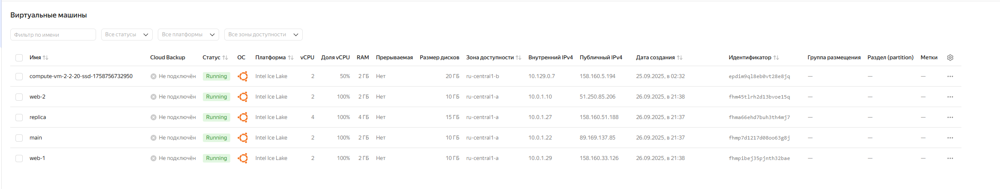

# Задание 2

В `variables.tf` дописали:
```hcl
variable "each_vm" {
  type = list(object({
    vm_name     = string
    cpu         = number
    ram         = number
    disk_volume = number
  }))
  default = [
    { vm_name = "main",   cpu = 2, ram = 2, disk_volume = 10 },
    { vm_name = "replica", cpu = 4, ram = 4, disk_volume = 15 }
  ]
}
```
затем создали файл `locals.tf`:
```hcl
locals {
  ssh_pubkey = trimspace(file("~/.ssh/id_ed25519.pub"))
}
```

затем файл с циклом foreach `for_each-vm.tf`
```hcl
data "yandex_compute_image" "ubuntu" {
  family = "ubuntu-2404-lts"
}

resource "yandex_compute_instance" "db" {
  for_each    = { for vm in var.each_vm : vm.vm_name => vm }
  name        = each.value.vm_name
  platform_id = "standard-v3"

  resources {
    cores  = each.value.cpu
    memory = each.value.ram
  }

  boot_disk {
    initialize_params {
      image_id = data.yandex_compute_image.ubuntu.image_id
      size     = each.value.disk_volume
    }
  }

  network_interface {
    subnet_id           = yandex_vpc_subnet.develop.id
    nat                 = true
    security_group_ids  = [yandex_vpc_security_group.example.id]
  }

  metadata = {
    ssh-keys = "ubuntu:${local.ssh_pubkey}"
  }
}

```

и еще файл `count-vm.tf` чтоб получились две одинаковые web-ВМ через count:

```hcl
resource "yandex_compute_instance" "web" {
  count       = 2
  name        = "web-${count.index + 1}"
  platform_id = "standard-v3"

  resources {
    cores  = 2
    memory = 2
  }

  boot_disk {
    initialize_params {
      image_id = data.yandex_compute_image.ubuntu.image_id
      size     = 10
    }
  }

  network_interface {
    subnet_id           = yandex_vpc_subnet.develop.id
    nat                 = true
    security_group_ids  = [yandex_vpc_security_group.example.id]
  }

  metadata = {
    ssh-keys = "ubuntu:${local.ssh_pubkey}"
  }

  depends_on = [yandex_compute_instance.db]
}
```

после уже по стандарту:
1. `terraform validate` -> ok
2. `terraform plan` -> итоговый план с всеми ВМ
3. `terraform apply` -> после небольшого ожидания видим, что все развернулось успешно

