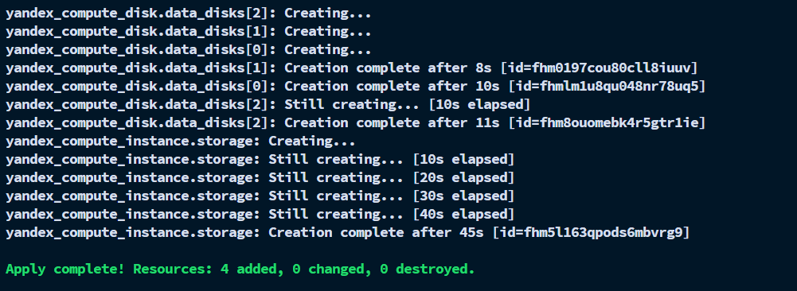
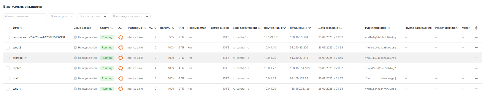
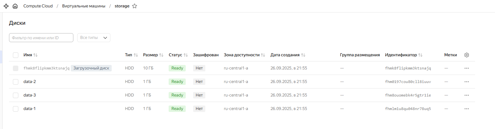

# Задание 3

Создали файл `disk_vm.tf`:
```hcl
resource "yandex_compute_disk" "data_disks" {
  count = 3
  name  = "data-${count.index + 1}"
  type  = "network-hdd"
  size  = 1
  zone  = var.default_zone
}

resource "yandex_compute_instance" "storage" {
  name        = "storage"
  platform_id = "standard-v3"

  resources {
    cores  = 2
    memory = 2
  }

  boot_disk {
    initialize_params {
      image_id = data.yandex_compute_image.ubuntu.image_id
      size     = 10
    }
  }

  network_interface {
    subnet_id          = yandex_vpc_subnet.develop.id
    nat                = true
    security_group_ids = [yandex_vpc_security_group.example.id]
  }

  dynamic "secondary_disk" {
    for_each = yandex_compute_disk.data_disks[*].id
    content {
      disk_id = secondary_disk.value
    }
  }

  metadata = {
    ssh-keys = "ubuntu:${local.ssh_pubkey}"
  }
}
```

после `terraform validate` и `terraform plan` -> все ок
делаем `terraform apply` и идем смотреть в консоль YC:


