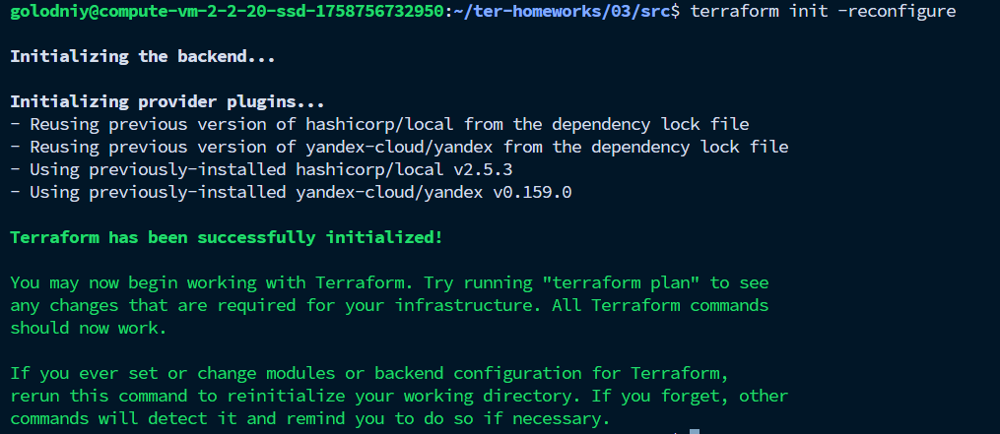

# Задание 4

К сожалению, ветку terraform-03 создать не могу, так как отличается подход ведения домашних заданий (общий репозиторий ДЗ)
Ссылка на коммит с выполненым заданием: https://github.com/mambastick/ter-homeworks/commit/eabaf1f8ad382f2a234e09efa082cab7738adb8c
Также дополнительно репозиторий подключен как сабмодуль.

1. Создал файл `hosts.tftpl`:
```tpl
[webservers]
%{ for h in webservers ~}
${h.name} ansible_host=${h.ip} fqdn=${h.fqdn}
%{ endfor ~}

[databases]
%{ for h in databases ~}
${h.name} ansible_host=${h.ip} fqdn=${h.fqdn}
%{ endfor ~}

[storage]
%{ for h in storage ~}
${h.name} ansible_host=${h.ip} fqdn=${h.fqdn}
%{ endfor ~}
```

2. Создал файл `ansible.tftpl`:
```hcl
locals {
  web = [
    for w in yandex_compute_instance.web : {
      name = w.name
      ip   = w.network_interface[0].nat_ip_address
      fqdn = w.fqdn
    }
  ]

  db = [
    for _, d in yandex_compute_instance.db : {
      name = d.name
      ip   = d.network_interface[0].nat_ip_address
      fqdn = d.fqdn
    }
  ]

  storage = [
    {
      name = yandex_compute_instance.storage.name
      ip   = yandex_compute_instance.storage.network_interface[0].nat_ip_address
      fqdn = yandex_compute_instance.storage.fqdn
    }
  ]
}

resource "local_file" "ansible_inventory" {
  content = templatefile("${path.module}/hosts.tftpl", {
    webservers = local.web
    databases  = local.db
    storage    = local.storage
  })
  filename = "${path.module}/inventory/hosts.ini"
}
```

3. `terraform init -reconfigure`


4. `terraform validate`


5. `terraform apply`

p.s. у меня скакнул инет и отрубилась ssh сессия, поэтому изначальный вывод не сохранился, но все работает :D

6. Вывод списка хостов `cat inventory/hosts.ini`:
