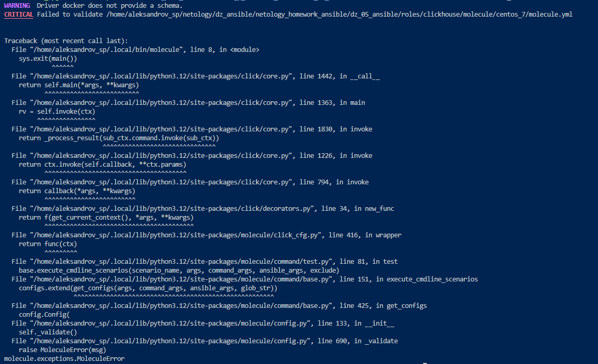
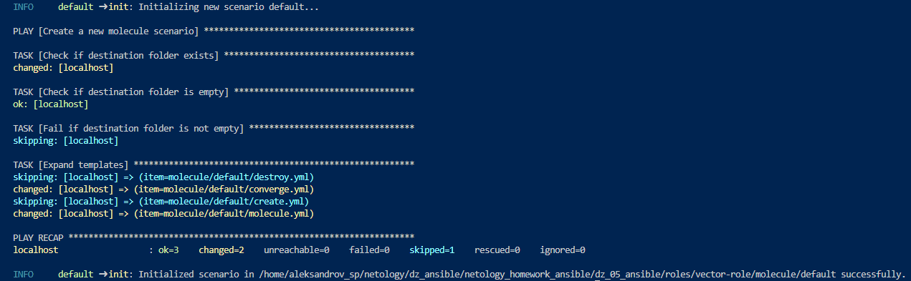
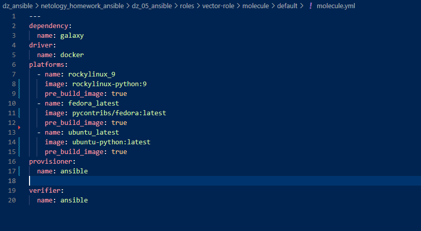
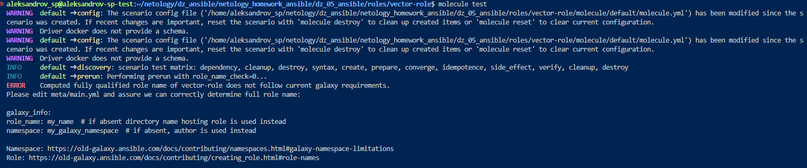
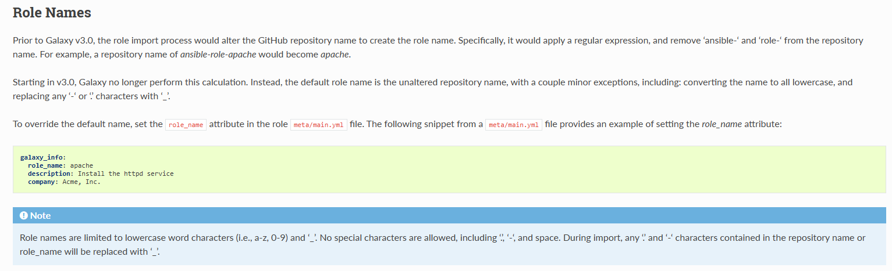
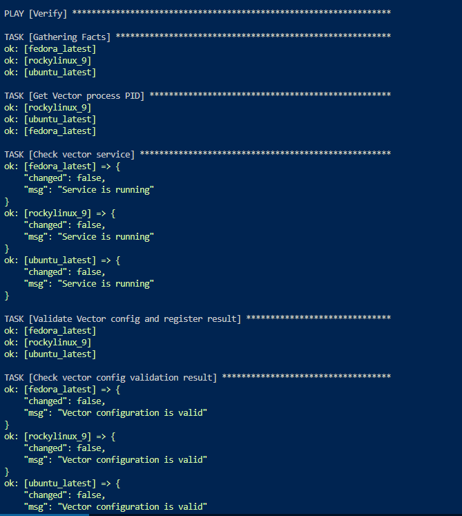
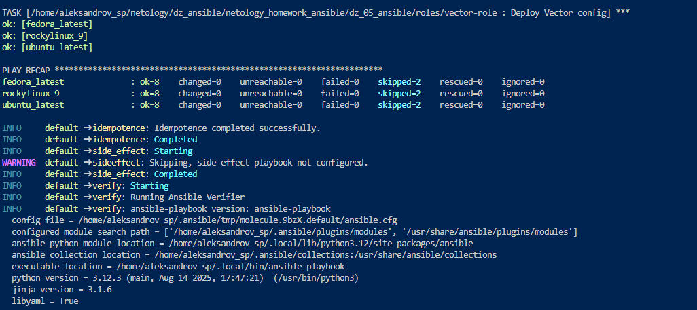
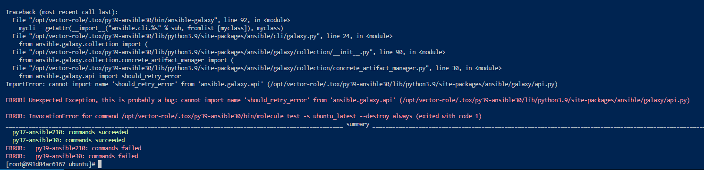
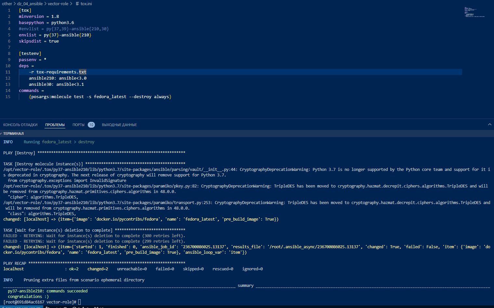

# Домашнее задание к занятию 5 «Тестирование roles»

[Задание](https://github.com/netology-code/mnt-homeworks/tree/MNT-video/08-ansible-05-testing)

---
### Решение:

[08.05 Тестирование ролей](https://github.com/mambastick/netology-ansible/releases/tag/08.05)

# Molecule

# Tox

