# Домашнее задание к занятию 11 «TeamCity»

[Оригинальное задание](https://github.com/netology-code/mnt-homeworks/blob/MNT-video/09-ci-05-teamcity/README.md)

## Подготовка к выполнению

1. Создана VM для TeamCity Server на базе образа `jetbrains/teamcity-server`.
2. Выполнена первоначальная настройка TeamCity.
3. Создана VM для TeamCity Agent на базе образа `jetbrains/teamcity-agent`.
4. Для агента задана переменная окружения `SERVER_URL=http://<teamcity_url>:8111`.
5. Агент авторизован в TeamCity.
6. Подготовлен fork репозитория `example-teamcity`.
7. Создана отдельная VM для Nexus и запущен playbook из директории `infrastructure`.

## Основная часть

### 1. Создание проекта и первая сборка

В TeamCity создан новый проект на основе fork репозитория.

Autodetect обнаружил build step, после сохранения конфигурации запущена первая сборка ветки `main`.

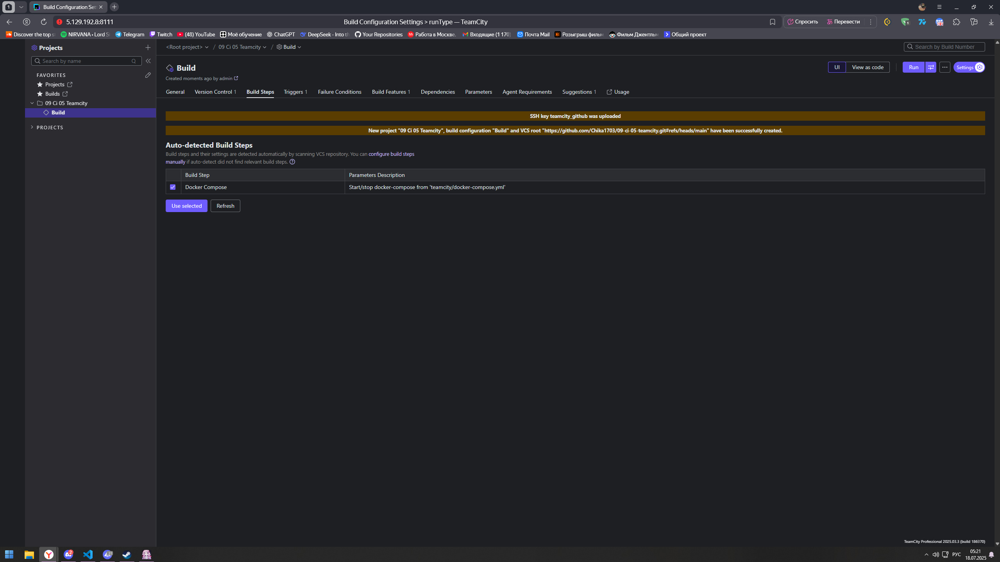

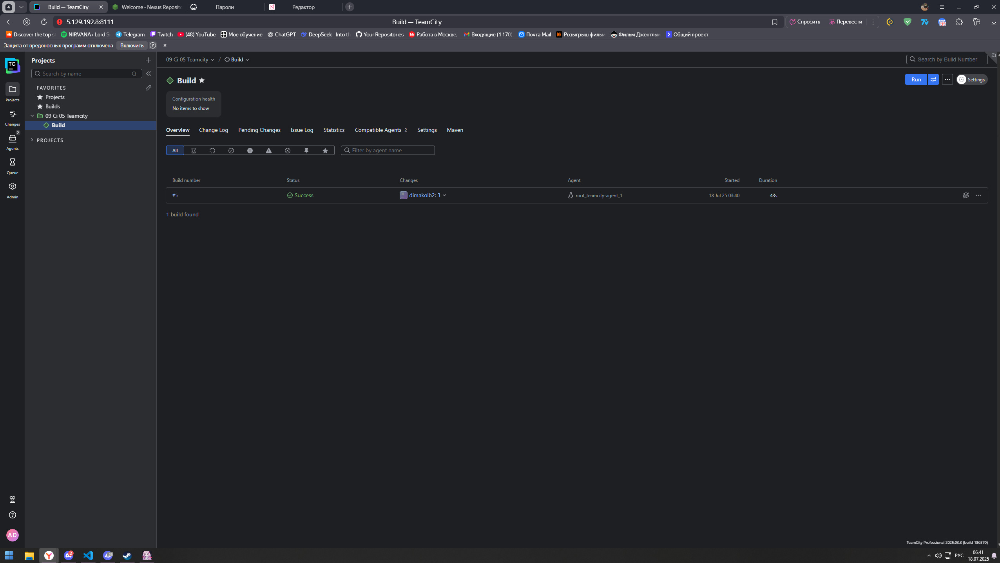

### 2. Настройка условий сборки

В build configuration добавлены два Maven шага:

- для ветки `main`: `mvn clean deploy`;
- для остальных веток: `mvn clean test`.

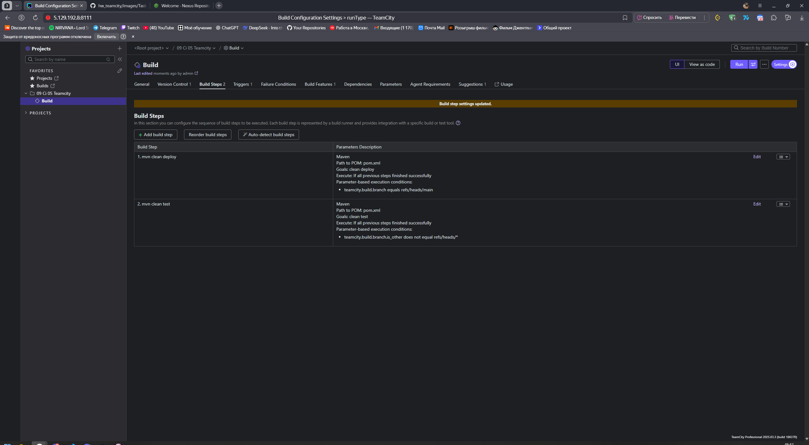

### 3. Настройка Maven deploy в Nexus

В TeamCity загружен Maven settings file для подключения к Nexus.

В `pom.xml` указан `distributionManagement` с репозиторием Nexus:

```xml
<distributionManagement>
    <repository>
        <id>nexus</id>
        <url>http://<nexus_host>:8081/repository/maven-releases/</url>
    </repository>
</distributionManagement>
```

После запуска сборки `main` артефакт опубликован в Nexus.

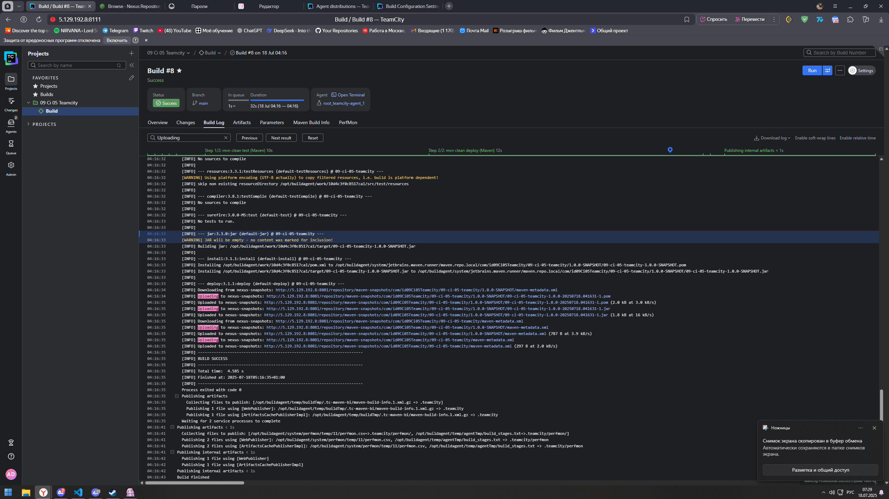

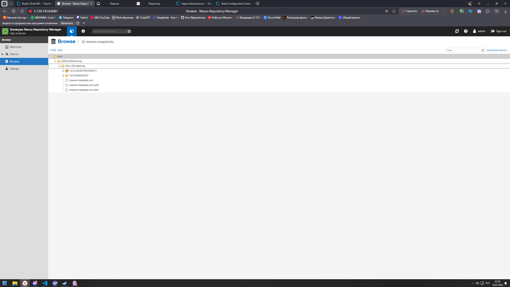

### 4. Миграция build configuration в репозиторий

Build configuration мигрирована в репозиторий через Versioned Settings.

Конфигурация хранится в директории `.teamcity`.

### 5. Ветка `feature/add_reply`

Создана отдельная ветка:

```bash
git checkout -b feature/add_reply
```

В класс `Welcomer` добавлен метод, который возвращает реплику со словом `hunter`.

```java
public String sayHunterReply() {
    return "Good hunter, your build is ready.";
}
```

В тест добавлена проверка наличия слова `hunter`.

```java
@Test
public void welcomerSaysHunterReply() {
    assertThat(welcomer.sayHunterReply(), containsString("hunter"));
}
```

После push ветки `feature/add_reply` сборка запустилась автоматически, Maven test завершился успешно.

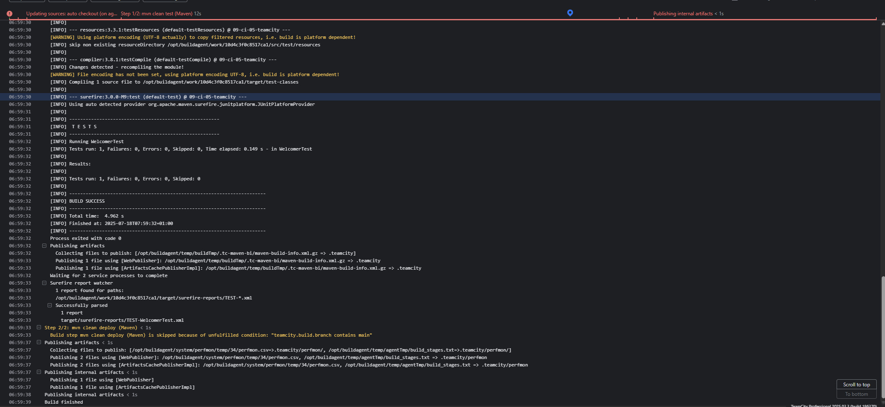

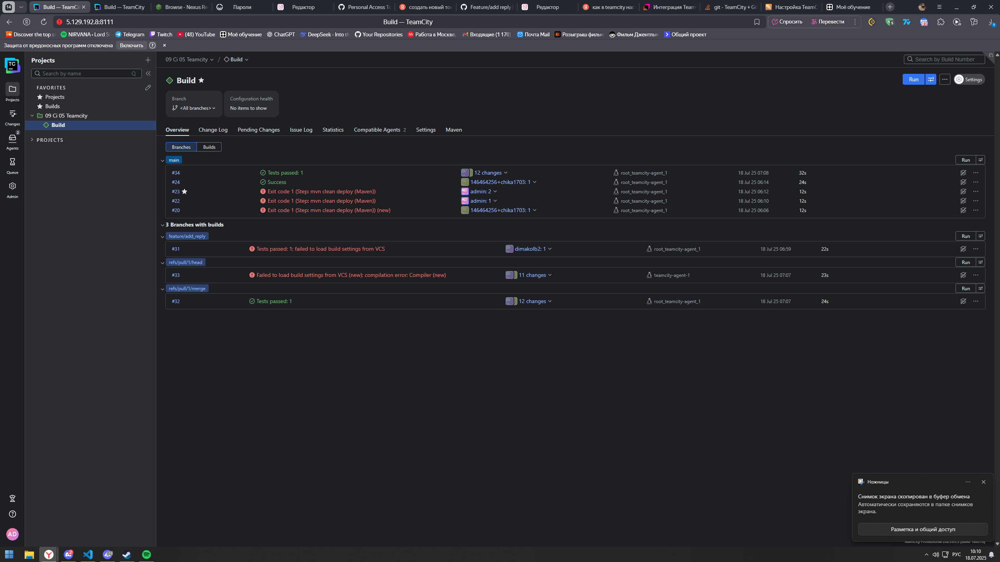

### 6. Merge в `main`

Изменения из ветки `feature/add_reply` внесены в `main` через merge.

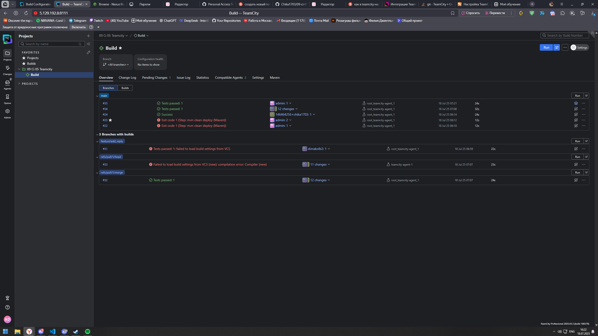

### 7. Артефакты сборки

Сначала проверено, что в сборке `main` нет сохраненного `.jar` artifact.

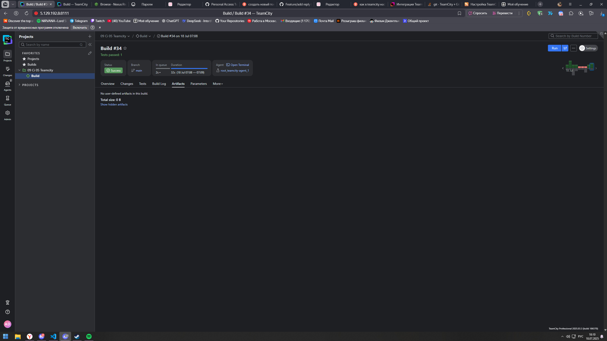

После этого в build configuration добавлено правило публикации артефактов:

```text
target/*.jar
```

Повторная сборка `main` завершилась успешно, `.jar` появился в артефактах сборки.

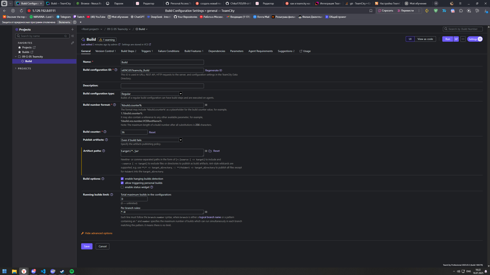

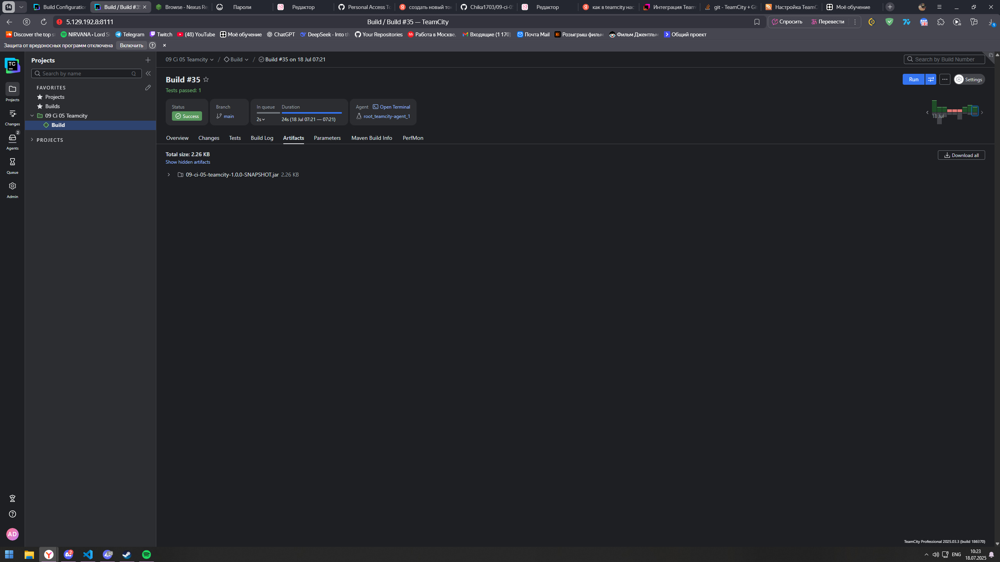

### 8. Проверка конфигурации в репозитории

Проверено, что директория `.teamcity` содержит актуальные настройки build configuration:

- Maven шаг `mvn clean deploy` для `main`;
- Maven шаг `mvn clean test` для остальных веток;
- VCS trigger;
- artifact rule `target/*.jar`;
- Maven settings для Nexus.
