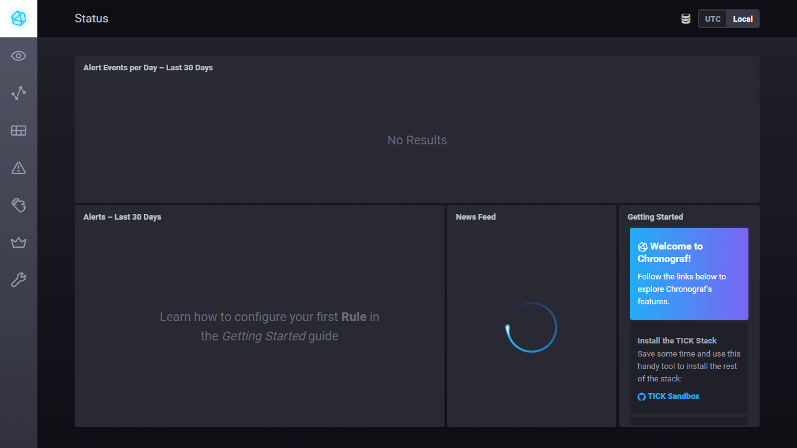
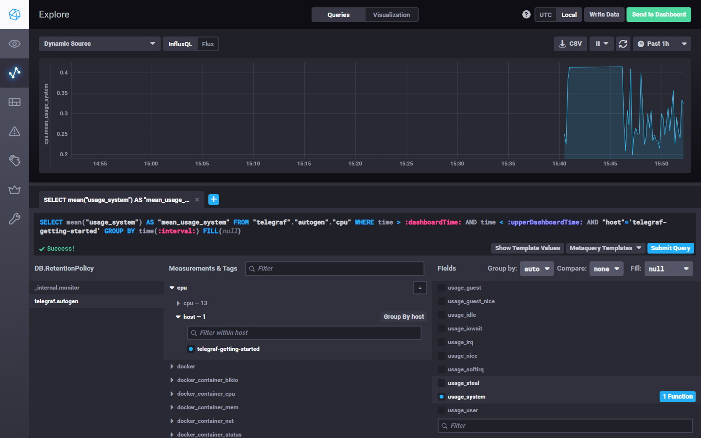
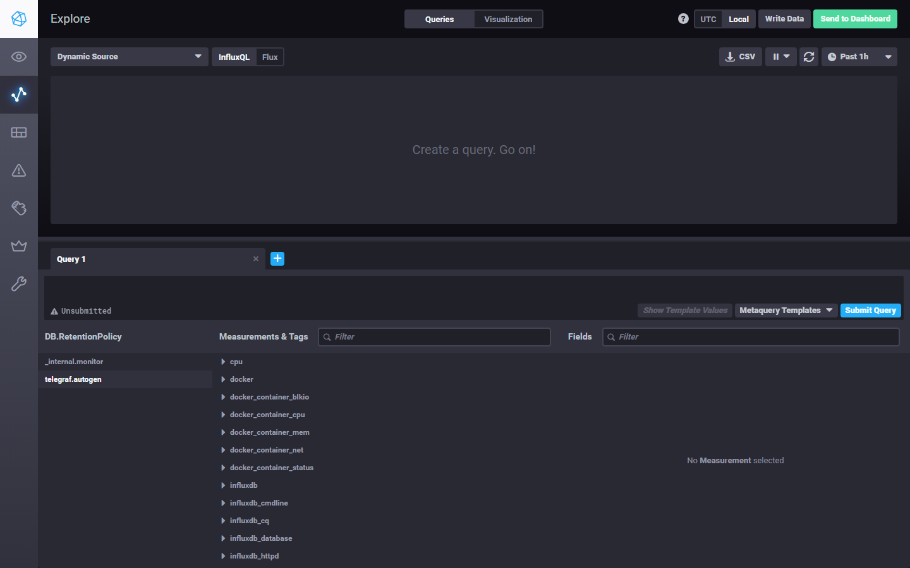

# Домашнее задание к занятию «Системы мониторинга»

[Оригинальное задание](https://github.com/netology-code/mnt-homeworks/blob/MNT-video/10-monitoring-02-systems/README.md)

## Обязательные задания

### 1. Минимальный набор метрик

Для проекта с HTTP-интерфейсом, CPU-нагрузкой и сохранением отчетов на диск я бы вывел такой минимальный набор:

- HTTP: доступность endpoint'ов, RPS, коды ответов, p95/p99 latency. Это показывает, отвечает ли сервис клиентам и как быстро.
- CPU: загрузка CPU по ядрам, load average, throttling/steal при виртуализации или контейнерах. Вычисления нагружают CPU, поэтому это основной ресурс риска.
- RAM и swap: использование памяти, OOM/restarts. Нехватка памяти приведет к падению расчетов или деградации.
- Диск: свободное место, inodes, latency/IOPS, ошибки записи. Отчеты сохраняются на диск, значит важны и объем, и количество доступных файлов.
- Состояние процесса: uptime, рестарты, healthcheck. Это быстрый индикатор живости приложения.
- Прикладные метрики: количество созданных отчетов, ошибки генерации, длительность расчета отчета, размер очереди задач. Эти метрики ближе всего к реальной функции сервиса.

### 2. Что предложить продукту вместо RAM/inodes/CPUla

Технические метрики нужно оставить для эксплуатации, а для продукта добавить SLI/SLO/SLA-дашборд:

- Availability: доля успешных клиентских запросов за период, например `99.9%`.
- Latency SLO: например `95% HTTP-запросов быстрее 500 мс`.
- Report SLO: например `95% отчетов формируются быстрее 2 минут`.
- Error rate: доля ошибочных запросов и неуспешных генераций отчетов.
- Freshness/completeness: отчет сформирован и доступен клиенту после завершения расчета.

Так менеджер будет видеть не `CPUla`, а качество сервиса: «сколько клиентов получили ответ», «как быстро», «сколько отчетов успешно создано» и «выполняем ли обещанный уровень сервиса».

### 3. Ошибки приложения без бюджета на систему логов

Минимальное решение без покупки отдельной системы логирования:

- договориться с разработчиками, что приложения пишут ошибки в `stderr/stdout` в структурированном формате;
- использовать штатные логи Docker/journald и `logrotate`, чтобы не потерять ошибки и не заполнить диск;
- дать разработчикам read-only доступ к логам нужных контейнеров/сервисов;
- настроить простую отправку `ERROR/FATAL` событий в командный канал или почту.

Это не заменяет полноценный Loki/ELK/OpenSearch, но позволяет разработчикам видеть ошибки приложения без отдельного бюджета на централизованную платформу.

### 4. Ошибка в формуле SLA по HTTP-кодам

Формула `summ_2xx_requests / summ_all_requests` считает успешными только `2xx`. Если в системе нет `4xx` и `5xx`, но показатель не выше 70%, то оставшиеся 30% с большой вероятностью являются `3xx`-ответами.

Если редиректы считаются корректным поведением сервиса, формула должна учитывать их как успешные:

```text
(summ_2xx_requests + summ_3xx_requests) / summ_all_requests
```

Иначе нужно отдельно разобрать, почему сервис так часто отдает `3xx`.

### 5. Pull и push системы мониторинга

Pull-модель:

- плюсы: сервер сам контролирует scrape-интервал, проще видеть недоступные targets, удобная service discovery, меньше логики в приложении;
- минусы: сервер мониторинга должен иметь сетевой доступ к targets, сложнее с NAT/firewall и короткоживущими job'ами.

Push-модель:

- плюсы: подходит для short-lived задач, edge-сервисов и закрытых сетей, агент сам отправляет данные наружу;
- минусы: сложнее понять, что источник умер, нужно решать буферизацию, backpressure, дубли и аутентификацию на приемнике.

### 6. Классификация систем

- Prometheus — pull по основной модели; push возможен через Pushgateway для специальных случаев.
- TICK — push: Telegraf собирает метрики и отправляет их в InfluxDB.
- Zabbix — гибрид: passive agent опрашивается сервером, active agent и trapper работают ближе к push.
- VictoriaMetrics — гибрид: принимает push/remote write, а через vmagent может работать в Prometheus-like pull-модели.
- Nagios — в основном pull через активные проверки с сервера; passive checks дают push-сценарий.

### 7. Запуск TICK stack

Склонирован репозиторий `influxdata/sandbox` и поднят TICK stack через Docker Compose.



### 8. CPU usage в Chronograf Data Explorer

В Data Explorer выбрана база `telegraf.autogen`, measurement `cpu`, tag `host=telegraf-getting-started`, field `usage_system`.



### 9. Telegraf docker input

В `sandbox/telegraf/telegraf.conf` добавлен docker input:

```toml
[[inputs.docker]]
  endpoint = "unix:///var/run/docker.sock"
  timeout = "5s"
```

В `sandbox/docker-compose.yml` для `telegraf` подключен Docker socket и включен `privileged: true`. Для Docker Desktop контейнер запущен с `user: "999:0"`, чтобы штатный entrypoint Telegraf имел доступ к `/var/run/docker.sock`.

После перезапуска появились docker measurements в базе `telegraf.autogen`.



