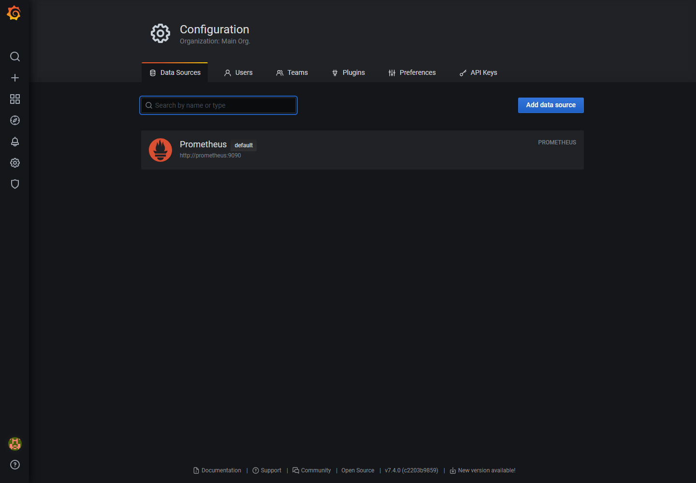
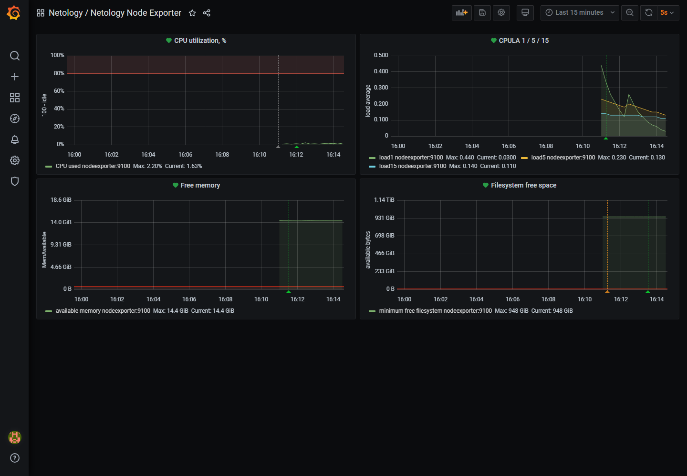
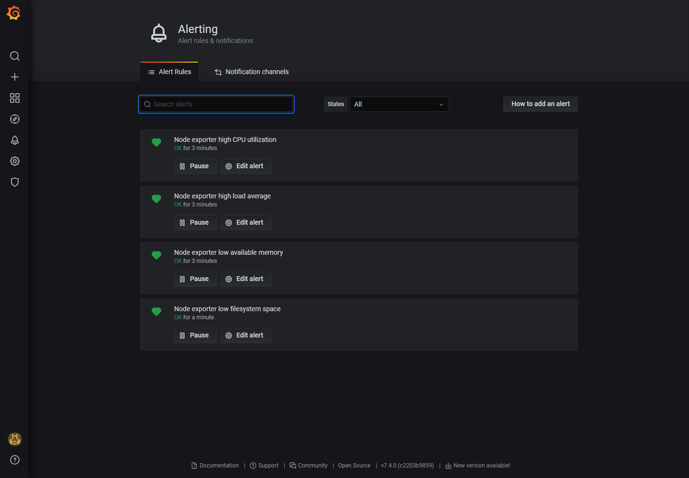

# Домашнее задание к занятию «Средство визуализации Grafana»

[Оригинальное задание](https://github.com/netology-code/mnt-homeworks/blob/MNT-video/10-monitoring-03-grafana/README.md)

## Обязательные задания

Задания со звездочкой не выполнялись. Стек развернут локально через Docker Compose:

```bash
docker-compose up -d
```

Сервисы:

- Grafana: `http://localhost:3000`, логин `admin`, пароль `admin`;
- Prometheus: `http://localhost:9090`;
- node-exporter: `http://localhost:9100/metrics`.

## 1. Подключение Prometheus к Grafana

Prometheus добавлен в Grafana как datasource через provisioning-файл `grafana/provisioning/datasources/prometheus.yml`.



## 2. Dashboard с метриками node-exporter

Создан dashboard `Netology Node Exporter` с четырьмя панелями.

PromQL-запросы:

```promql
100 - (avg by(instance) (irate(node_cpu_seconds_total{job="nodeexporter",mode="idle"}[5m])) * 100)
```

```promql
node_load1{job="nodeexporter"}
node_load5{job="nodeexporter"}
node_load15{job="nodeexporter"}
```

```promql
node_memory_MemAvailable_bytes{job="nodeexporter"}
```

```promql
max by(instance) (node_filesystem_avail_bytes{job="nodeexporter",fstype!~"tmpfs|fuse.*|overlay|squashfs|rootfs"})
```



## 3. Alert rules

Для панелей dashboard настроены alert rules:

- `Node exporter high CPU utilization`: CPU utilization больше `80%` в течение `1m`;
- `Node exporter high load average`: `node_load1` больше `4` в течение `1m`;
- `Node exporter low available memory`: доступная память меньше `512 MiB` в течение `1m`;
- `Node exporter low filesystem space`: свободное место на файловой системе меньше `1 GiB` в течение `1m`.

Итоговый dashboard с индикаторами alert rules:


Список alert rules в Grafana:



## 4. JSON MODEL dashboard

JSON MODEL сохранен отдельным файлом:

```text
grafana/dashboards/netology-node-exporter-dashboard.json
```

Файл содержит полный листинг dashboard и используется Grafana provisioning при запуске контейнера.
