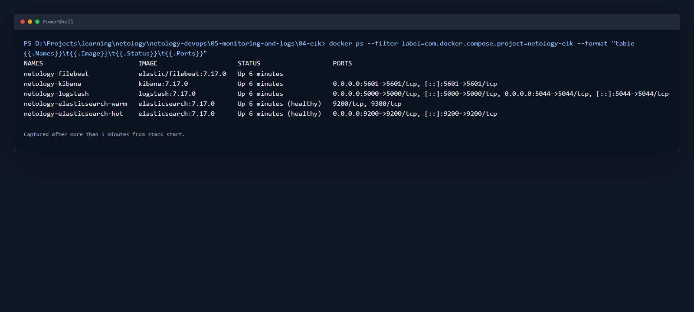
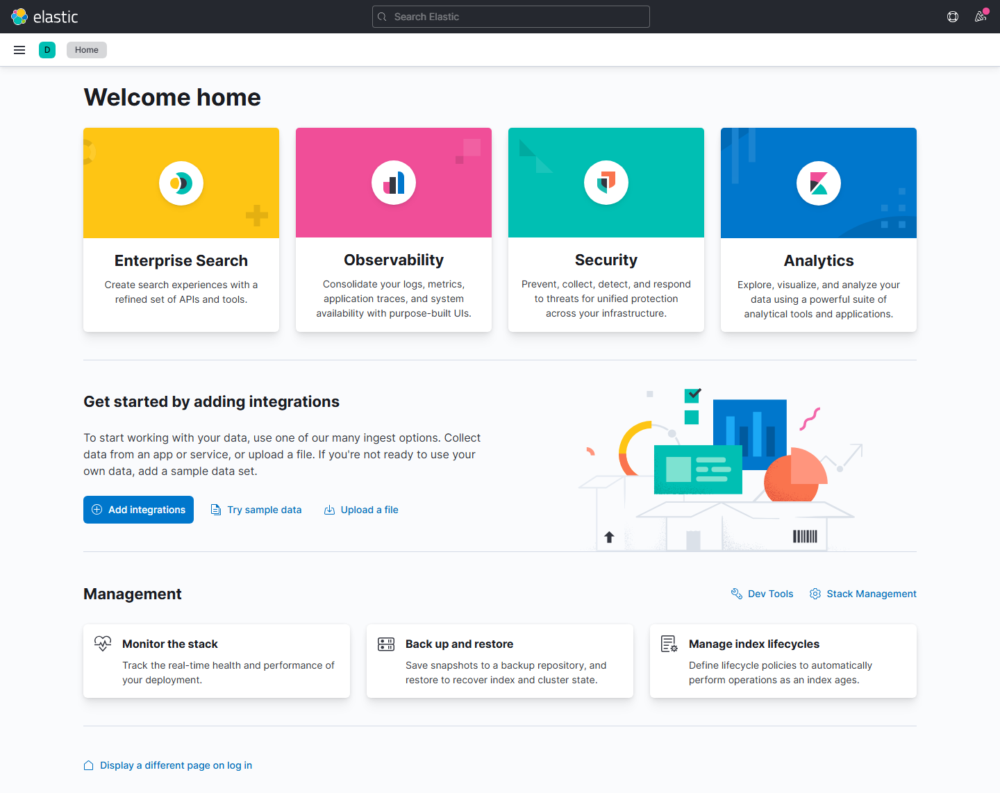
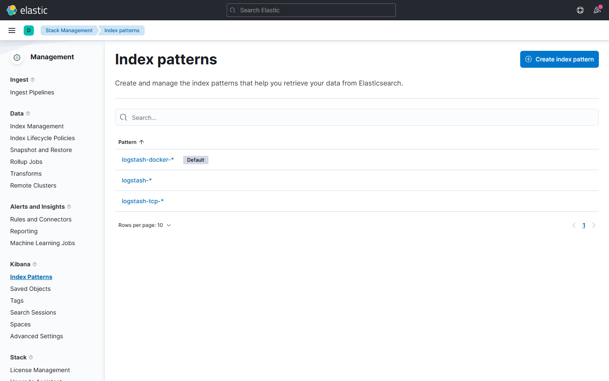
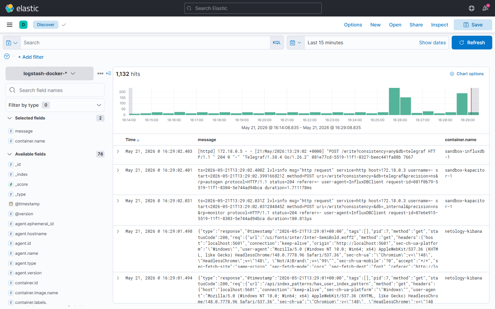
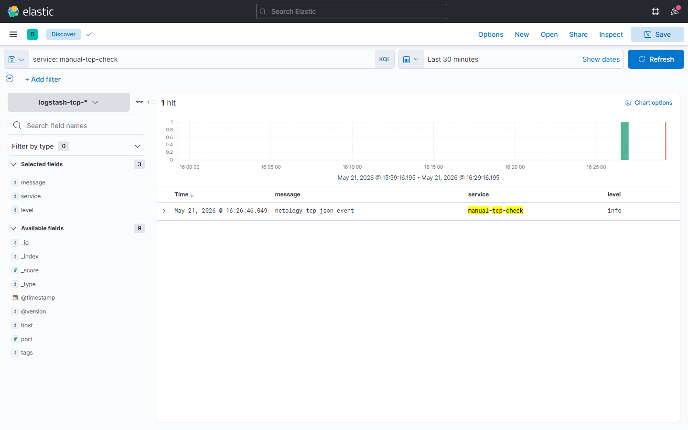

# Домашнее задание к занятию «Система сбора логов Elastic Stack»

[Оригинальное задание](https://github.com/netology-code/mnt-homeworks/blob/MNT-video/10-monitoring-04-elk/README.md)

## Задание 1

Стек Elastic Stack поднят локально через Docker Compose. Директория `help` из задания не использовалась, поэтому manifest и конфигурации сохранены в этом каталоге:

- `docker-compose.yml`;
- `filebeat/filebeat.yml`;
- `logstash/pipeline/logstash.conf`;
- `kibana/kibana.yml`.

Запуск:

```bash
docker-compose up -d
```

Состав стека:

- `elasticsearch-hot`: master, hot data, content data, ingest node;
- `elasticsearch-warm`: warm data, ingest node;
- `logstash`: принимает события Filebeat на `5044/tcp` и JSON-сообщения на `5000/tcp`;
- `kibana`: доступна на `http://localhost:5601`;
- `filebeat`: читает Docker JSON-логи из `/var/lib/docker/containers/*/*.log` и отправляет их в Logstash.

Logstash раскладывает события по индексам:

- Docker-логи: `logstash-docker-YYYY.MM.DD`;
- TCP JSON-сообщения: `logstash-tcp-YYYY.MM.DD`.

Проверка `docker ps` спустя больше пяти минут после запуска стека:



Интерфейс Kibana:



## Задание 2

В Kibana созданы index patterns:

- `logstash-*`;
- `logstash-docker-*`;
- `logstash-tcp-*`.

Список index patterns:



Просмотр Docker-логов в Discover:



Проверка TCP JSON-входа Logstash: в `localhost:5000` отправлено JSON-событие, которое попало в индекс `logstash-tcp-*`.



## Проверка

Кластер Elasticsearch содержит две ноды:

```text
elasticsearch-hot  -> master, data_hot, data_content, ingest
elasticsearch-warm -> data_warm, ingest
```

Созданные индексы:

```text
logstash-docker-2026.05.21
logstash-tcp-2026.05.21
```
