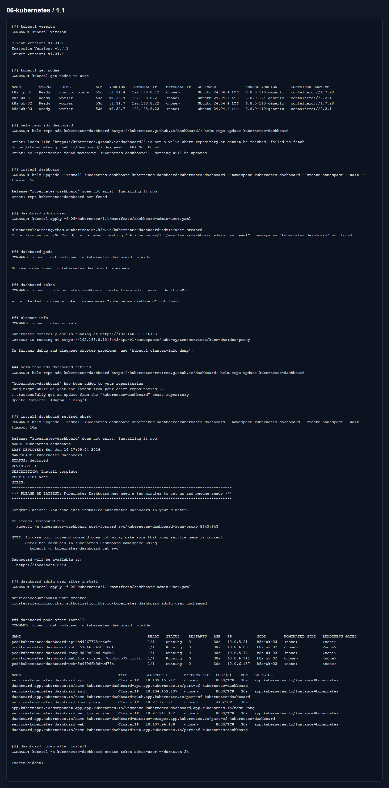
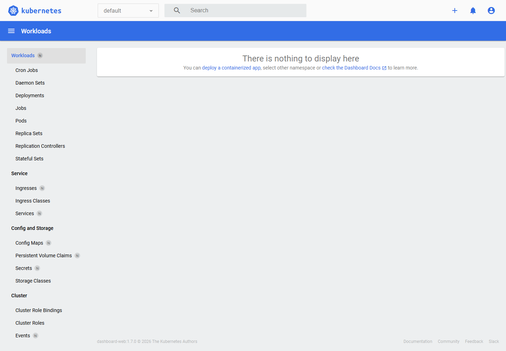

# Домашнее задание 1.1 «Kubernetes. Причины появления. Команда kubectl»

[Оригинальное задание](https://github.com/netology-code/kuber-homeworks/blob/main/1.1/1.1.md)

[Текст задания](TASK.md)

## Что сделал

Вместо MicroK8S использовал уже поднятый kubeadm-кластер. `kubectl` подключен локально, кластер отвечает, ноды видны.

Dashboard поставил через Helm chart из актуального репозитория `https://kubernetes-retired.github.io/dashboard`, потому что старый URL chart-репозитория уже отдает `404`. Для входа создал временный service account `admin-user`.

Манифест:

- [dashboard-admin-user.yaml](manifests/dashboard-admin-user.yaml)

## Результат

Вывод команд:

Dashboard через port-forward:

