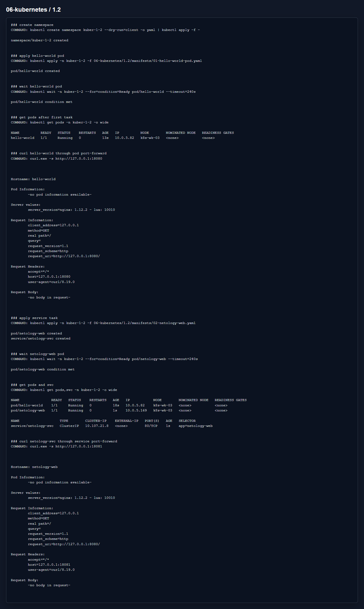

# Домашнее задание 1.2 «Базовые объекты K8S»

[Оригинальное задание](https://github.com/netology-code/kuber-homeworks/blob/main/1.2/1.2.md)

[Текст задания](TASK.md)

## Что сделал

Создал namespace `kuber-1-2`.

В первой задаче поднял Pod `hello-world` с образом `gcr.io/kubernetes-e2e-test-images/echoserver:2.2` и подключился к нему через `kubectl port-forward`.

Во второй задаче поднял Pod `netology-web`, Service `netology-svc` и проверил доступ уже через Service.

Манифесты:

- [01-hello-world-pod.yaml](manifests/01-hello-world-pod.yaml)
- [02-netology-web.yaml](manifests/02-netology-web.yaml)

## Результат

На скрине видно, что оба pod запущены, а `curl` через port-forward возвращает ответ echoserver.

