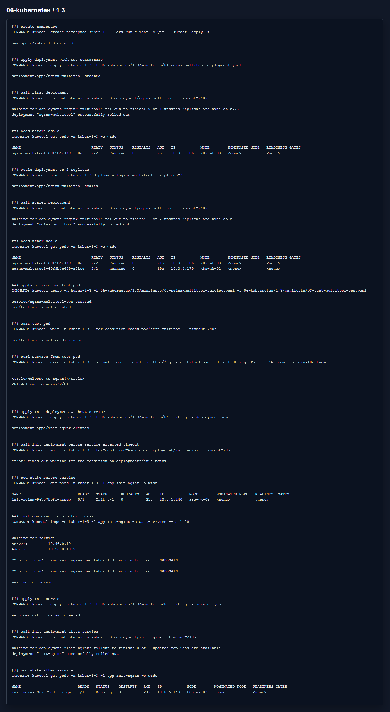

# Домашнее задание 1.3 «Запуск приложений в K8S»

[Оригинальное задание](https://github.com/netology-code/kuber-homeworks/blob/main/1.3/1.3.md)

[Текст задания](TASK.md)

## Что сделал

Создал Deployment `nginx-multitool` из двух контейнеров. У multitool поменял порты на `8080` и `8443`, потому что иначе он конфликтует с nginx за порт `80`.

Потом увеличил количество реплик до `2`, создал Service и проверил доступ из отдельного pod `test-multitool`.

Для второй задачи сделал Deployment `init-nginx`: основной nginx стартует только после того, как init-container увидит Service `init-nginx-svc`.

Манифесты:

- [01-nginx-multitool-deployment.yaml](manifests/01-nginx-multitool-deployment.yaml)
- [02-nginx-multitool-service.yaml](manifests/02-nginx-multitool-service.yaml)
- [03-test-multitool-pod.yaml](manifests/03-test-multitool-pod.yaml)
- [04-init-nginx-deployment.yaml](manifests/04-init-nginx-deployment.yaml)
- [05-init-nginx-service.yaml](manifests/05-init-nginx-service.yaml)

## Результат

До создания Service pod с init-container висит в `Init:0/1`, после создания Service становится `Running`.

