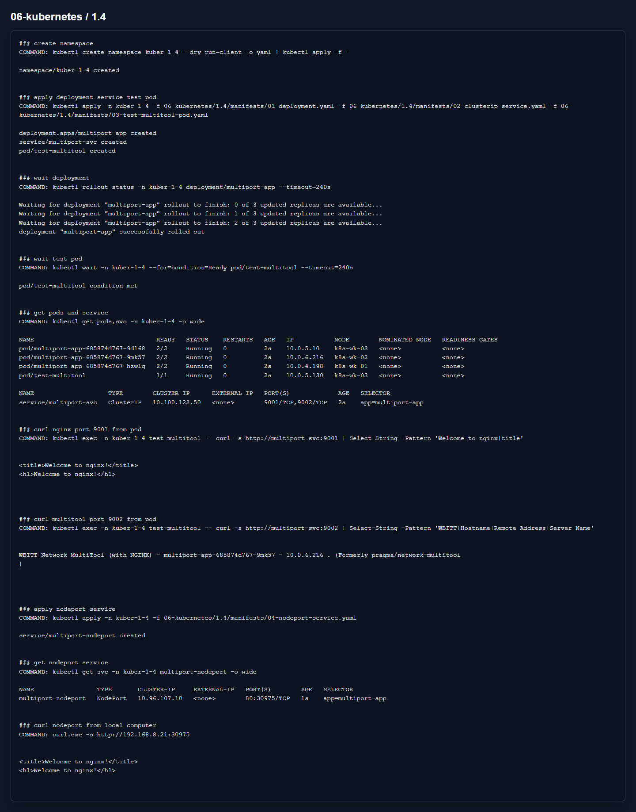

# Домашнее задание 1.4 «Сетевое взаимодействие в K8S. Часть 1»

[Оригинальное задание](https://github.com/netology-code/kuber-homeworks/blob/main/1.4/1.4.md)

[Текст задания](TASK.md)

## Что сделал

Создал Deployment из `3` реплик, внутри каждого pod два контейнера: nginx и multitool. Через ClusterIP Service развел порты:

- `9001` идет в nginx на `80`;
- `9002` идет в multitool на `8080`.

Проверку сделал из отдельного pod `test-multitool`. Для внешнего доступа добавил Service типа `NodePort`.

Манифесты:

- [01-deployment.yaml](manifests/01-deployment.yaml)
- [02-clusterip-service.yaml](manifests/02-clusterip-service.yaml)
- [03-test-multitool-pod.yaml](manifests/03-test-multitool-pod.yaml)
- [04-nodeport-service.yaml](manifests/04-nodeport-service.yaml)

## Результат

На скрине видно ответы с обоих портов и проверку NodePort с локальной машины.

