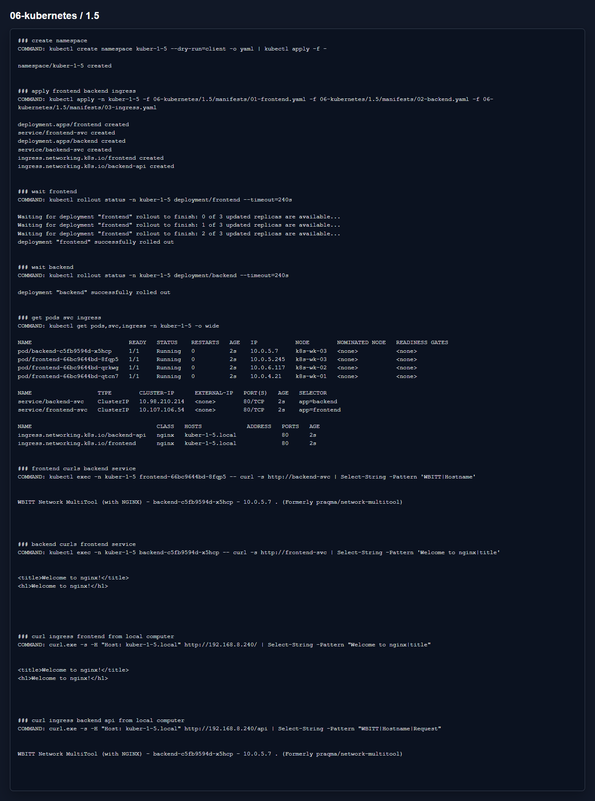

# Домашнее задание 1.5 «Сетевое взаимодействие в K8S. Часть 2»

[Оригинальное задание](https://github.com/netology-code/kuber-homeworks/blob/main/1.5/1.5.md)

[Текст задания](TASK.md)

## Что сделал

Поднял frontend на nginx в `3` репликах и backend на multitool. Для обоих приложений создал ClusterIP Service.

Ingress сделал по host `kuber-1-5.local`:

- `/` открывает frontend;
- `/api` открывает backend.

Для `/api` добавил rewrite, потому что backend нормально отвечает на `/`, а на `/api` отдавал 404.

Манифесты:

- [01-frontend.yaml](manifests/01-frontend.yaml)
- [02-backend.yaml](manifests/02-backend.yaml)
- [03-ingress.yaml](manifests/03-ingress.yaml)

## Результат

На скрине есть проверка связи frontend/backend через Service и проверка Ingress с локальной машины через заголовок `Host`.

