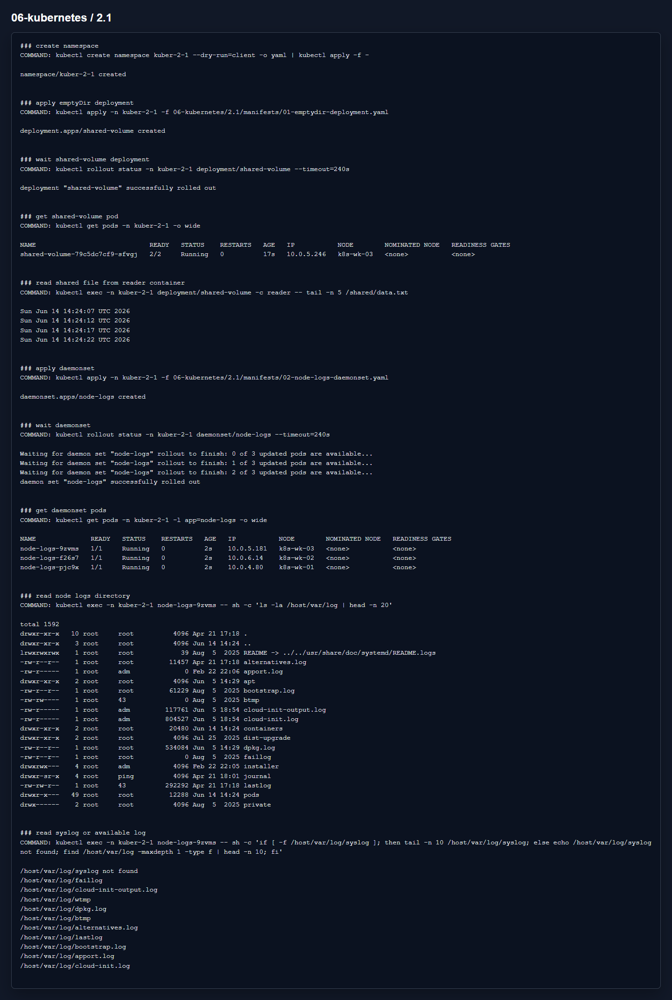

# Домашнее задание 2.1 «Хранение в K8s. Часть 1»

[Оригинальное задание](https://github.com/netology-code/kuber-homeworks/blob/main/2.1/2.1.md)

[Текст задания](TASK.md)

## Что сделал

В первой задаче создал Deployment из двух контейнеров: busybox пишет время в файл, multitool читает этот же файл через общий `emptyDir`.

Во второй задаче создал DaemonSet, который монтирует `/var/log` ноды в контейнер через `hostPath`.

Манифесты:

- [01-emptydir-deployment.yaml](manifests/01-emptydir-deployment.yaml)
- [02-node-logs-daemonset.yaml](manifests/02-node-logs-daemonset.yaml)

## Результат

Файл из `emptyDir` читается. На нодах Ubuntu 24 в этом кластере файла `/var/log/syslog` нет, поэтому показал сам каталог `/var/log` и доступные лог-файлы.

