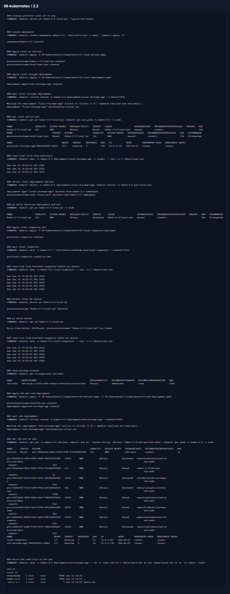

# Домашнее задание 2.2 «Хранение в K8s. Часть 2»

[Оригинальное задание](https://github.com/netology-code/kuber-homeworks/blob/main/2.2/2.2.md)

[Текст задания](TASK.md)

## Что сделал

Для первой задачи создал PV/PVC с `persistentVolumeReclaimPolicy: Retain` и Deployment, где busybox пишет файл, а multitool его читает.

После удаления Deployment и PVC PV перешел в `Released`. Файл на hostPath остался. После удаления PV объект пропал, но файл на диске ноды все равно остался, потому что Kubernetes удалил только свой объект, а не данные на хосте.

Для второй задачи использовал уже настроенный StorageClass `nfs-safe`. Он динамически создал PV для PVC `nfs-pvc`.

Манифесты:

- [01-local-pv-pvc.yaml](manifests/01-local-pv-pvc.yaml)
- [02-local-deployment.yaml](manifests/02-local-deployment.yaml)
- [03-local-inspector-pod.yaml](manifests/03-local-inspector-pod.yaml)
- [04-nfs-pvc.yaml](manifests/04-nfs-pvc.yaml)
- [05-nfs-deployment.yaml](manifests/05-nfs-deployment.yaml)

## Результат

На скрине видно `Bound`, потом `Released`, чтение файла после удаления PV и запись в динамический NFS PVC.

