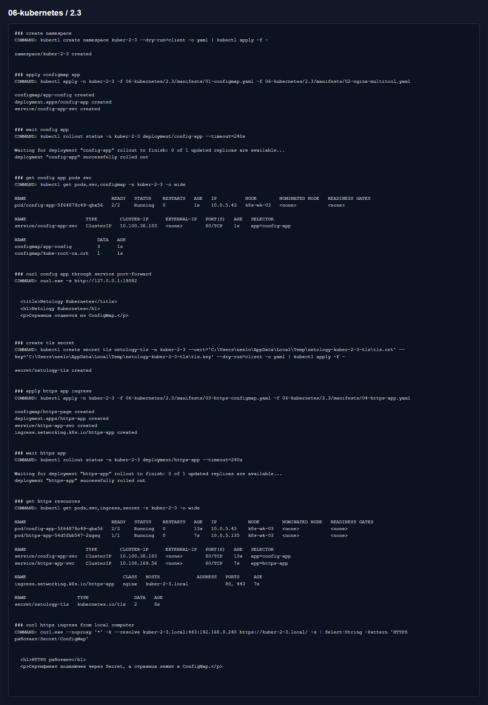

# Домашнее задание 2.3 «Конфигурация приложений»

[Оригинальное задание](https://github.com/netology-code/kuber-homeworks/blob/main/2.3/2.3.md)

[Текст задания](TASK.md)

## Что сделал

В первой задаче поднял nginx и multitool в одном pod. Конфигурацию портов multitool и страницу nginx вынес в ConfigMap.

Во второй задаче создал отдельную страницу из ConfigMap, выпустил самоподписанный сертификат, создал Secret `netology-tls` и подключил HTTPS через Ingress.

Приватный ключ сертификата в репозиторий не сохранял, он создавался временно только для команды `kubectl create secret tls`.

Манифесты:

- [01-configmap.yaml](manifests/01-configmap.yaml)
- [02-nginx-multitool.yaml](manifests/02-nginx-multitool.yaml)
- [03-https-configmap.yaml](manifests/03-https-configmap.yaml)
- [04-https-app.yaml](manifests/04-https-app.yaml)

## Результат

На скрине видно страницу из ConfigMap через Service и HTTPS-ответ через Ingress.

