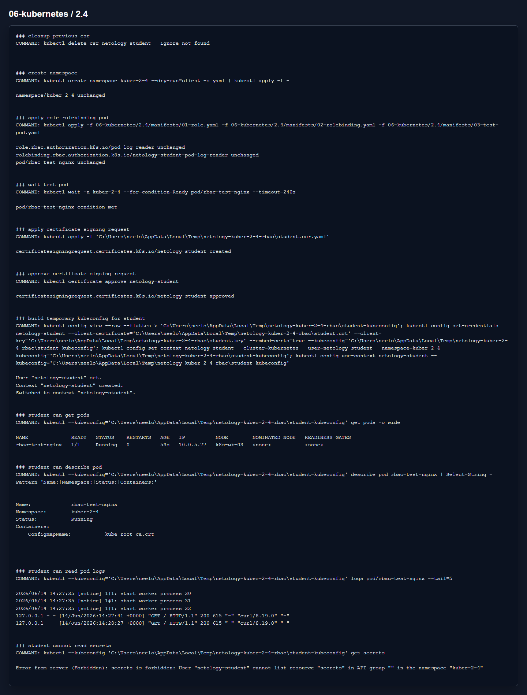

# Домашнее задание 2.4 «Управление доступом»

[Оригинальное задание](https://github.com/netology-code/kuber-homeworks/blob/main/2.4/2.4.md)

[Текст задания](TASK.md)

## Что сделал

Создал пользователя `netology-student` через Kubernetes CertificateSigningRequest. Сертификат и kubeconfig создавались временно и в репозиторий не сохранялись.

Для пользователя сделал Role и RoleBinding: можно смотреть pod, describe и logs, но нельзя читать Secret.

Манифесты:

- [01-role.yaml](manifests/01-role.yaml)
- [02-rolebinding.yaml](manifests/02-rolebinding.yaml)
- [03-test-pod.yaml](manifests/03-test-pod.yaml)

## Результат

На скрине видно, что пользователь читает pod и logs, а `get secrets` получает `Forbidden`.

