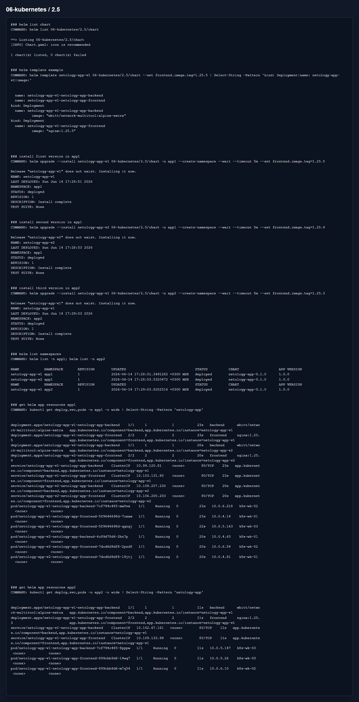

# Домашнее задание 2.5 «Helm»

[Оригинальное задание](https://github.com/netology-code/kuber-homeworks/blob/main/2.5/2.5.md)

[Текст задания](TASK.md)

## Что сделал

Собрал Helm chart `netology-app`. В нем frontend и backend деплоятся отдельными Deployment и Service.

Версия frontend меняется через `frontend.image.tag` в values. Для проверки поставил:

- `netology-app-v1` в namespace `app1`;
- `netology-app-v2` в namespace `app1`;
- `netology-app-v1` в namespace `app2`.

Chart:

- [chart](chart)

## Результат

`helm lint` прошел без ошибок, все три release установлены и pod находятся в `Running`.

