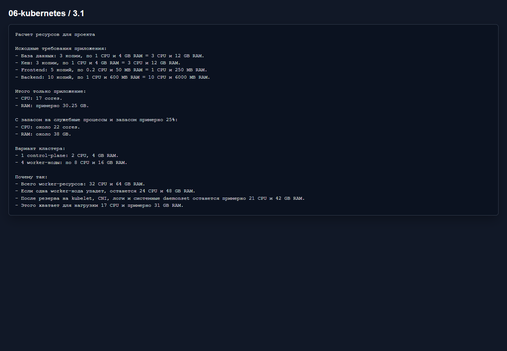

# Домашнее задание 3.1 «Компоненты Kubernetes»

[Оригинальное задание](https://github.com/netology-code/kuber-homeworks/blob/main/3.1/3.1.md)

[Текст задания](TASK.md)

## Расчет

Нагрузка приложения:

- База данных: `3 * 1 CPU`, `3 * 4 GB` = `3 CPU`, `12 GB RAM`;
- Кеш: `3 * 1 CPU`, `3 * 4 GB` = `3 CPU`, `12 GB RAM`;
- Frontend: `5 * 0.2 CPU`, `5 * 50 MB` = `1 CPU`, `250 MB RAM`;
- Backend: `10 * 1 CPU`, `10 * 600 MB` = `10 CPU`, примерно `6 GB RAM`.

Итого для приложения: `17 CPU` и примерно `30.25 GB RAM`.

Я бы заложил запас примерно `25%`: получается около `22 CPU` и `38 GB RAM`.

## Вариант кластера

- `1` control-plane node: `2 CPU`, `4 GB RAM`;
- `4` worker node: по `8 CPU`, `16 GB RAM`.

Если одна worker-нода упадет, останется `24 CPU` и `48 GB RAM`. После резерва на kubelet, CNI, логирование и daemonset останется примерно `21 CPU` и `42 GB RAM`, этого хватает для расчетной нагрузки.

## Результат

