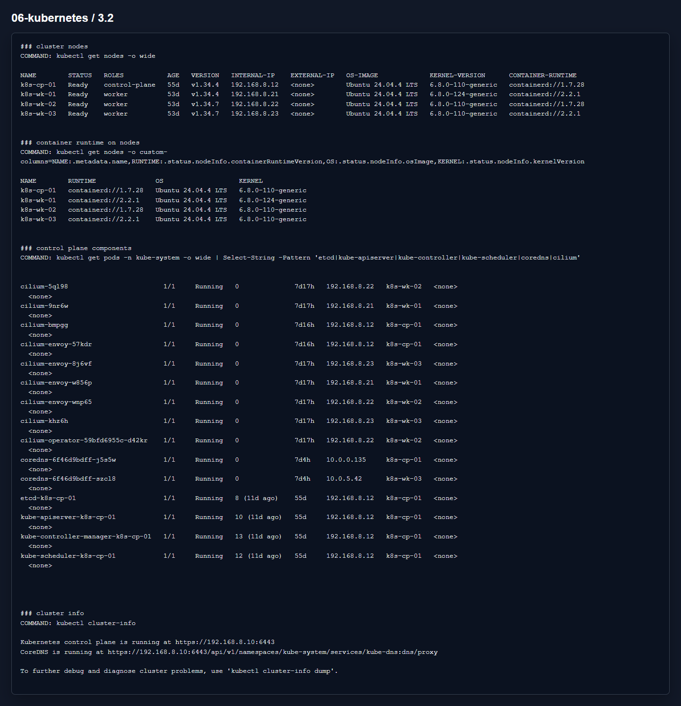

# Домашнее задание 3.2 «Установка Kubernetes»

[Оригинальное задание](https://github.com/netology-code/kuber-homeworks/blob/main/3.2/3.2.md)

[Текст задания](TASK.md)

## Что сделал

Задание показываю на уже установленном kubeadm-кластере. В текущем стенде `1` control-plane и `3` worker-ноды. В задании было `4` worker-ноды, но еще одну ВМ я здесь не добавлял, чтобы не менять реальную инфраструктуру.

CRI используется `containerd`, etcd запущен на control-plane.

Файл с инвентарем:

- [kubeadm-inventory.ini](files/kubeadm-inventory.ini)

## Результат

На скрине видно ноды, container runtime и control-plane компоненты.

