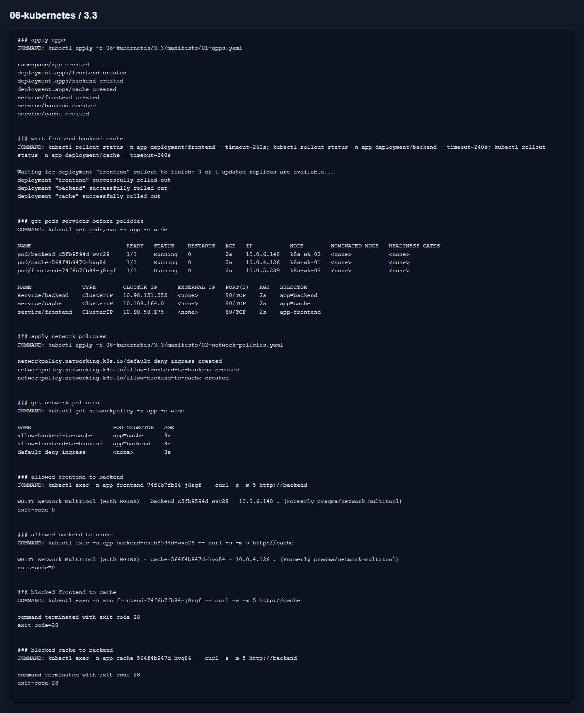

# Домашнее задание 3.3 «Как работает сеть в K8s»

[Оригинальное задание](https://github.com/netology-code/kuber-homeworks/blob/main/3.3/3.3.md)

[Текст задания](TASK.md)

## Что сделал

В задании написан Calico, но в текущем кластере стоит Cilium. Он тоже применяет стандартные Kubernetes `NetworkPolicy`, поэтому проверку сделал на нем.

Создал namespace `app`, Deployment и Service для `frontend`, `backend`, `cache`. После этого добавил политики:

- default deny на входящий трафик;
- разрешить `frontend -> backend`;
- разрешить `backend -> cache`.

Манифесты:

- [01-apps.yaml](manifests/01-apps.yaml)
- [02-network-policies.yaml](manifests/02-network-policies.yaml)

## Результат

На скрине видно, что разрешенные запросы дают `exit-code=0`, а запрещенные падают по timeout с `exit-code=28`.

