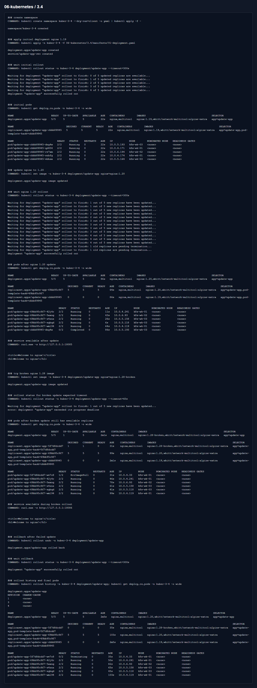

# Домашнее задание 3.4 «Обновление приложений»

[Оригинальное задание](https://github.com/netology-code/kuber-homeworks/blob/main/3.4/3.4.md)

[Текст задания](TASK.md)

## Стратегия

Для ситуации из первой задачи я бы выбрал blue-green или recreate в заранее выбранное окно. Причина простая: старые и новые версии несовместимы, а значит держать их вместе во время обычного rolling update опасно.

Для практической части сделал RollingUpdate с `maxSurge: 1` и `maxUnavailable: 0`. Так при запасе ресурсов около 20% можно добавить только один лишний pod, но приложение остается доступным.

## Что сделал

Создал Deployment из `5` реплик с nginx `1.19` и multitool. Потом обновил nginx до `1.20`.

Для проверки неудачного rollout использовал образ `nginx:1.28-broken`. Обычный тег `1.28` сейчас уже может существовать, поэтому взял явно битый тег, чтобы получить `ErrImagePull` и проверить откат.

Манифест:

- [01-deployment.yaml](manifests/01-deployment.yaml)

## Результат

На скрине видно успешный rollout до `1.20`, затем неудачный rollout, доступность Service во время ошибки и rollback обратно на рабочую версию.

