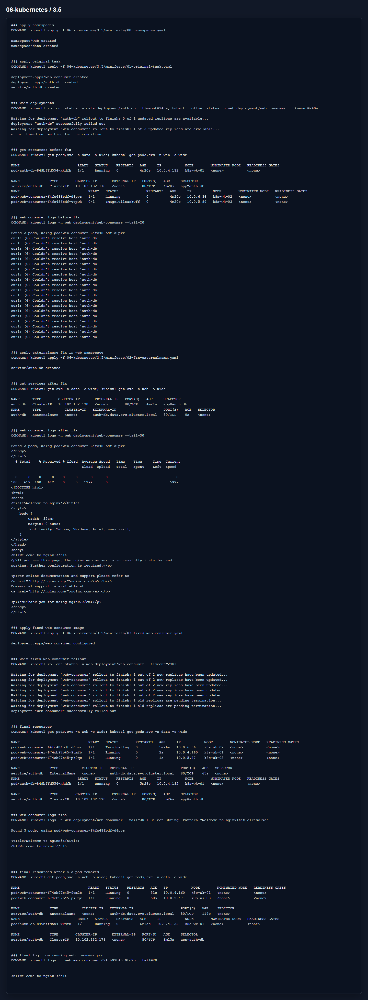

# Домашнее задание 3.5 «Troubleshooting»

[Оригинальное задание](https://github.com/netology-code/kuber-homeworks/blob/main/3.5/3.5.md)

[Текст задания](TASK.md)


## Проблема

`web-consumer` находится в namespace `web`, а Service `auth-db` находится в namespace `data`. Команда внутри pod делает `curl auth-db`, но короткое имя ищется только внутри своего namespace. Поэтому сначала в логах было:

```text
Couldn't resolve host 'auth-db'
```

## Что исправил

Добавил в namespace `web` Service `auth-db` типа `ExternalName`, который указывает на `auth-db.data.svc.cluster.local`.

Еще один момент: старый образ `radial/busyboxplus:curl` на одной ноде ушел в `ImagePullBackOff`, поэтому финальным манифестом заменил образ web-consumer на `wbitt/network-multitool:alpine-extra` с той же командой `curl auth-db`.

Манифесты:

- [00-namespaces.yaml](manifests/00-namespaces.yaml)
- [01-original-task.yaml](manifests/01-original-task.yaml)
- [02-fix-externalname.yaml](manifests/02-fix-externalname.yaml)
- [03-fixed-web-consumer.yaml](manifests/03-fixed-web-consumer.yaml)

## Результат

После исправления две реплики `web-consumer` в `Running`, а в логах есть ответ nginx от `auth-db`.




