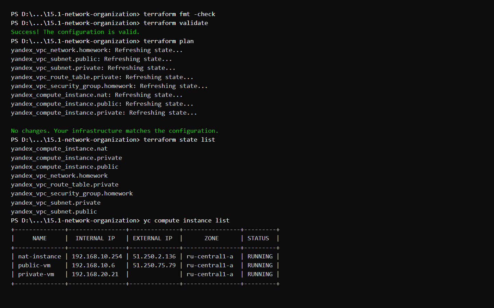
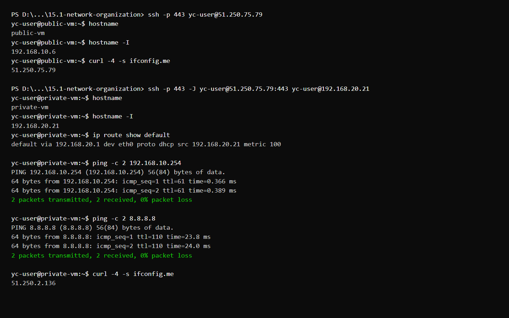

# Домашнее задание к занятию «Организация сети»

## Задание 1. Yandex Cloud

Инфраструктура создана Terraform в зоне `ru-central1-a`:

- VPC `netology-15-1`;
- публичная подсеть `public` — `192.168.10.0/24`;
- NAT-инстанс с внутренним адресом `192.168.10.254` и образом `fd80mrhj8fl2oe87o4e1`;
- публичная ВМ с внешним IP-адресом;
- приватная подсеть `private` — `192.168.20.0/24`;
- таблица маршрутизации с маршрутом `0.0.0.0/0` через `192.168.10.254`;
- приватная ВМ без внешнего IP-адреса.

Манифесты:

- [versions.tf](versions.tf) — версия Terraform и провайдер Yandex Cloud;
- [variables.tf](variables.tf) — входные переменные;
- [main.tf](main.tf) — VPC, подсети, маршрут, группа безопасности и ВМ;
- [outputs.tf](outputs.tf) — адреса и команды подключения.
- [terraform.rc](terraform.rc) — официальное зеркало провайдеров Yandex Cloud.

## Проверка Terraform и созданных ресурсов



## Проверка доступа в интернет

Подключение к приватной ВМ выполнено через публичную ВМ с помощью `ProxyJump`. Публичная и приватная ВМ успешно получили доступ в интернет.



## Запуск

Аутентификационные данные не хранятся в репозитории. Провайдер использует активный профиль Yandex Cloud CLI и переменные окружения:

```bash
export YC_TOKEN="$(yc iam create-token)"
export YC_CLOUD_ID="$(yc config get cloud-id)"
export YC_FOLDER_ID="$(yc config get folder-id)"
export TF_CLI_CONFIG_FILE="$PWD/terraform.rc"

terraform init
terraform apply
```
