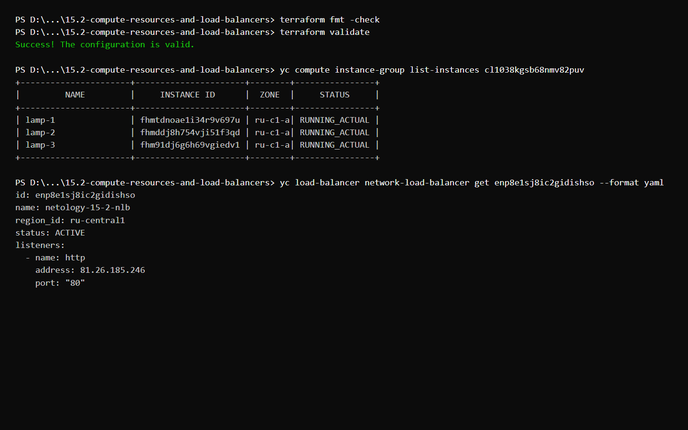
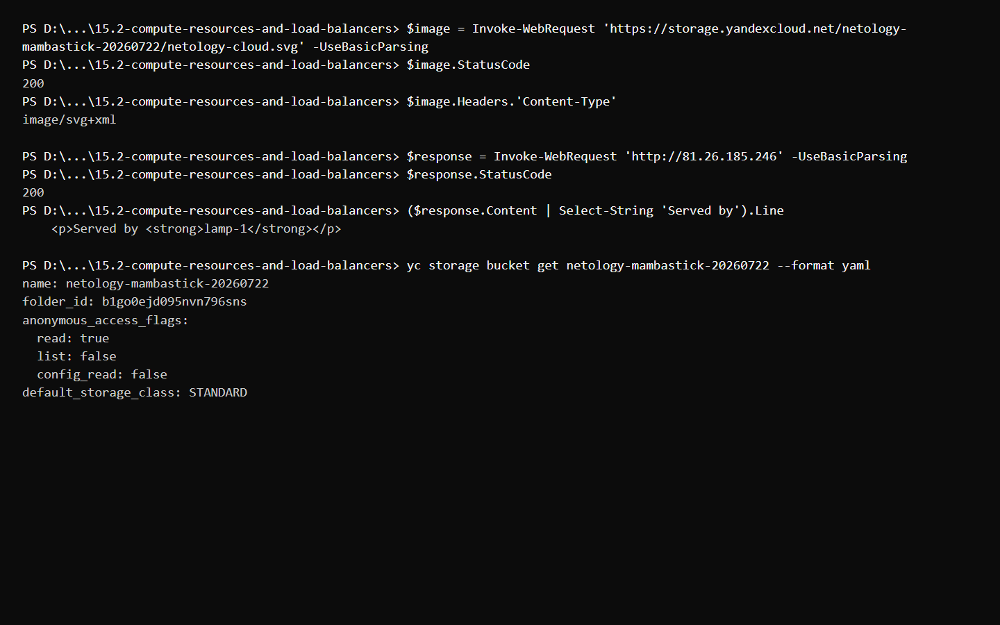
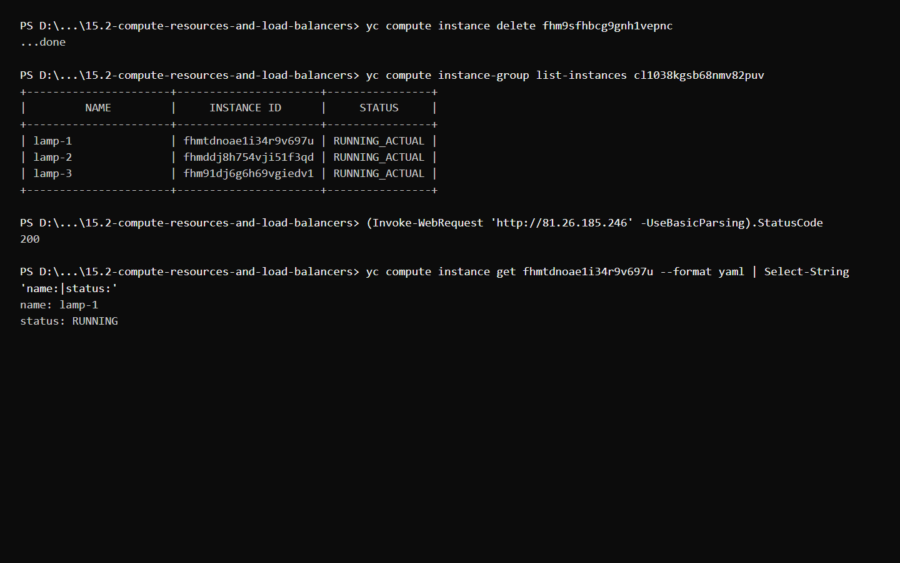

# Домашнее задание к занятию «Вычислительные мощности. Балансировщики нагрузки»

## Задание 1. Yandex Cloud

Terraform создаёт:

- публичный бакет Object Storage с изображением;
- VPC и публичную подсеть;
- фиксированную Instance Group из трёх LAMP-ВМ;
- HTTP-проверки состояния;
- внешний Network Load Balancer.

Манифесты:

- [main.tf](main.tf) — бакет, группа ВМ, проверки состояния и балансировщик;
- [cloud-init.yaml.tftpl](cloud-init.yaml.tftpl) — стартовая веб-страница;
- [variables.tf](variables.tf) — входные переменные;
- [outputs.tf](outputs.tf) — адрес изображения, состав группы и адрес балансировщика.

## Результат Terraform



## Проверка Object Storage и балансировщика

Изображение доступно из интернета. Запросы к Network Load Balancer возвращают страницу с именем обслужившей ВМ.



## Проверка восстановления Instance Group

Одна ВМ была удалена вручную. Instance Group автоматически восстановила фиксированный размер до трёх ВМ, после чего балансировщик продолжил отдавать страницу.



## Запуск

```bash
export YC_TOKEN="$(yc iam create-token)"
export YC_CLOUD_ID="$(yc config get cloud-id)"
export YC_FOLDER_ID="$(yc config get folder-id)"
export TF_CLI_CONFIG_FILE="$PWD/terraform.rc"

terraform init
terraform apply
```
