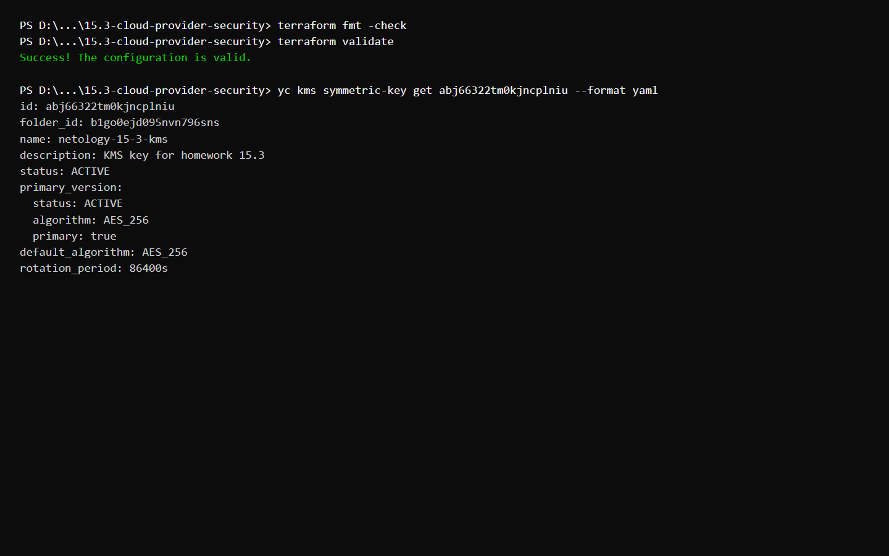
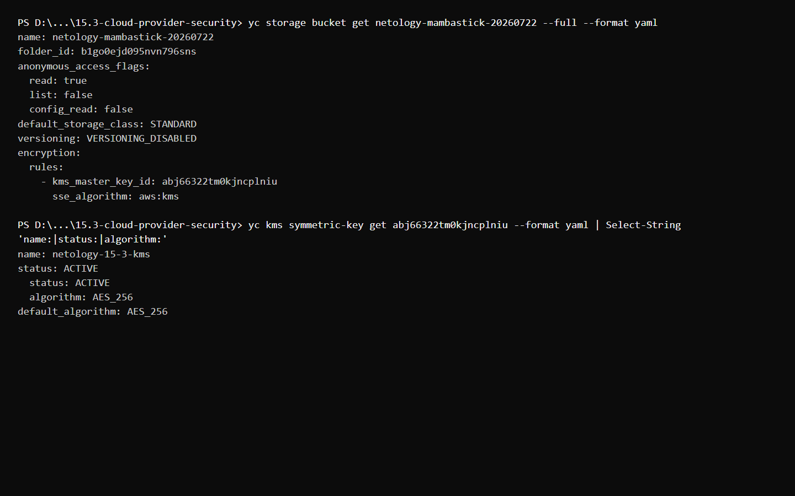

# Домашнее задание к занятию «Безопасность в облачных провайдерах»

## Задание 1. Yandex Cloud

Terraform создаёт:

- симметричный ключ KMS с алгоритмом `AES_256`;
- сервисный аккаунт с необходимыми правами;
- бакет Object Storage из задания 15.2 с шифрованием `aws:kms` по умолчанию;
- объект из предыдущего задания, содержимое которого зашифровано ключом KMS.

Манифесты:

- [main.tf](main.tf) — KMS, права доступа, бакет и объект;
- [variables.tf](variables.tf) — входные переменные;
- [outputs.tf](outputs.tf) — идентификатор ключа и адрес объекта.

## Созданные ресурсы



## Проверка шифрования

Конфигурация бакета содержит `sse_algorithm: aws:kms` и идентификатор созданного ключа.



## Запуск

```bash
export YC_TOKEN="$(yc iam create-token)"
export YC_CLOUD_ID="$(yc config get cloud-id)"
export YC_FOLDER_ID="$(yc config get folder-id)"
export TF_CLI_CONFIG_FILE="$PWD/terraform.rc"

terraform init
terraform import yandex_storage_bucket.encrypted netology-mambastick-20260722
terraform apply
```
