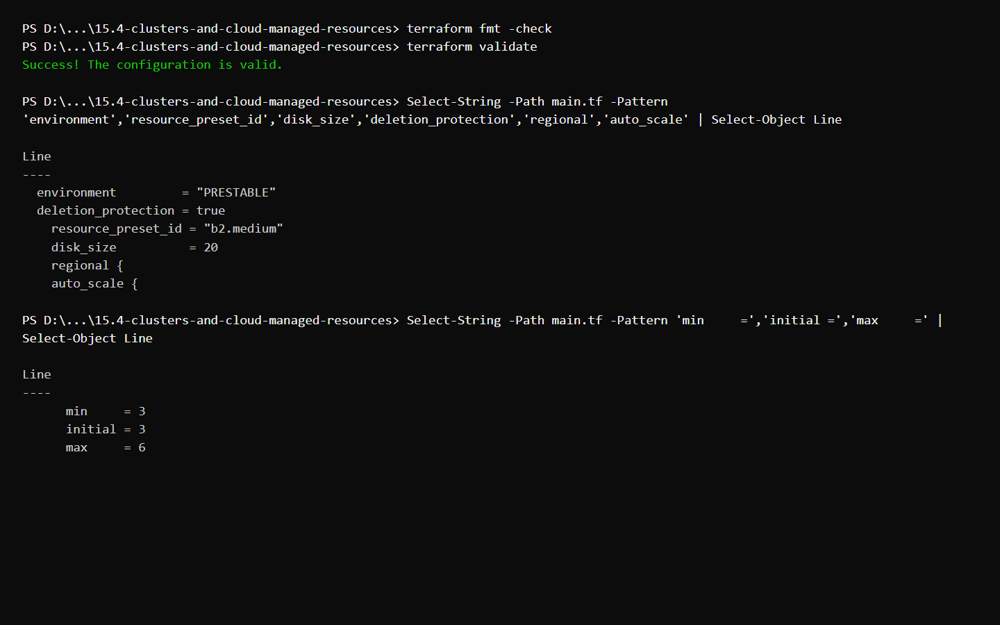
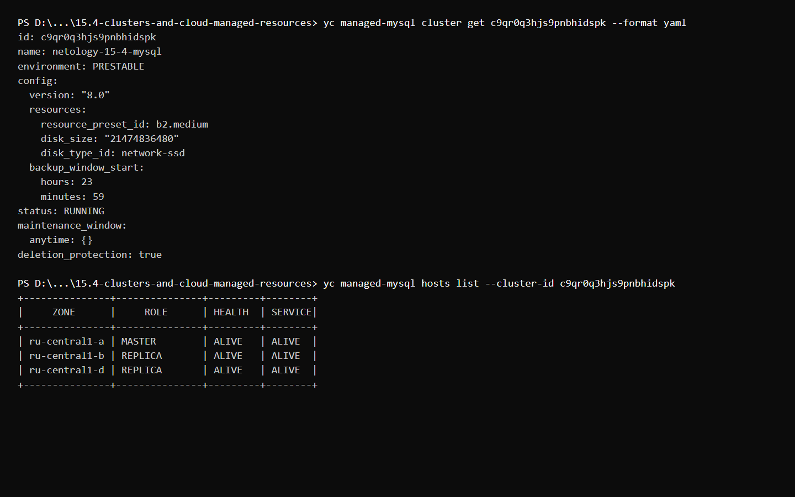
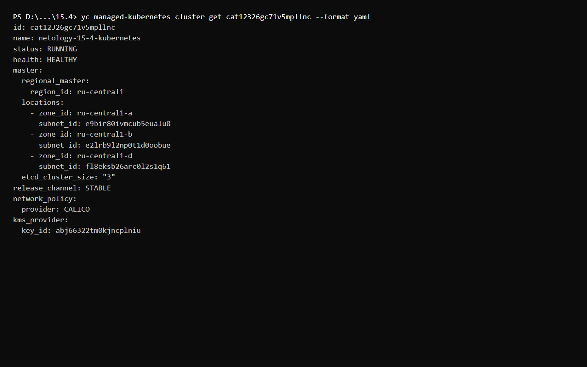
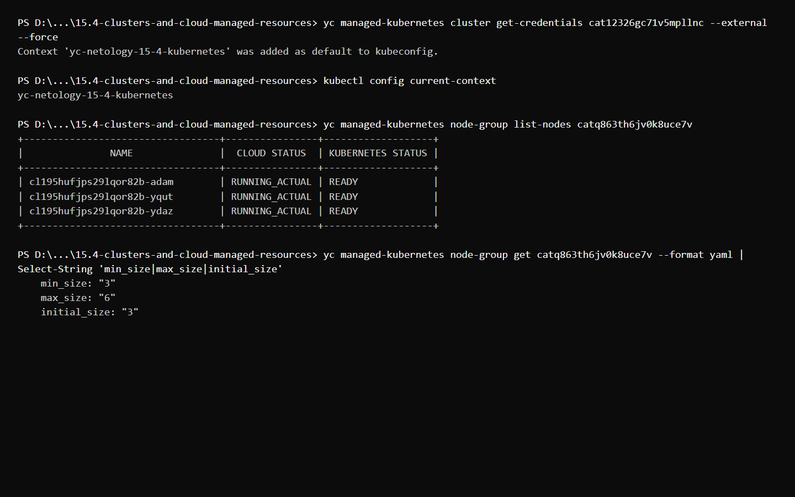

# Домашнее задание к занятию «Кластеры и ресурсы под управлением облачных провайдеров»

## Обязательные задания

Terraform создаёт:

- кластер Managed MySQL 8.0 с тремя приватными хостами в зонах `ru-central1-a`, `ru-central1-b` и `ru-central1-d`;
- базу данных `netology_db` и пользователя `netology`;
- региональный кластер управления Managed Kubernetes в трёх публичных подсетях;
- ключ KMS из задания 15.3 для шифрования секретов Kubernetes;
- группу рабочих узлов с тремя начальными узлами и автоматическим масштабированием от 3 до 6 узлов.

Кластер MySQL использует окружение `PRESTABLE`, конфигурацию Intel Broadwell `b2.medium` с гарантированной долей CPU 50%, сетевой SSD объёмом 20 ГБ, ежедневное резервное копирование в 23:59 UTC, произвольное окно обслуживания и защиту от удаления.

## Конфигурация Terraform

## Кластер Managed MySQL

## Кластер Managed Kubernetes

Учётные данные кластера получены с помощью Yandex Cloud CLI, после чего был проверен активный контекст `kubectl`. Все три начальных рабочих узла перешли в состояние `READY`:

После завершения проверок и создания скриншотов все временные облачные ресурсы были удалены.
